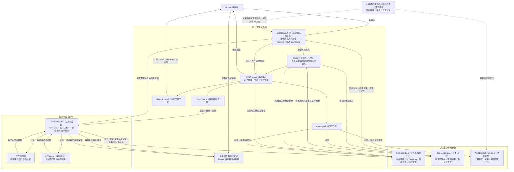

> 本文是项目开工前的原始设计。保留原文供追溯，不代表当前 Pi 实现已具备全部设计能力。当前实现说明见 [文档索引](README.md)。

# Secretary 逻辑架构设计（BrainStorm Baseline v3）

## 1. 逻辑架构图

图中实线表示已明确的调用或数据关系；虚线表示设计目标已涉及、但具体处理规则尚待细化的关系。记忆数据的分组不代表具体分库方式，任务调度与执行的分组不代表独立部署要求。主会话宿主代码属于唯一逻辑主会话的实现职责，详见第 2.4 节。

`MemoryUtil` 对 World Model 的变更操作仅提交提案，实际变更仍由后端按授权规则处理。Operation Log 的记录箭头表示系统在交互发生时留存原始记录，不表示将每轮完整 Context 重复写入，也不要求主会话主动调用写日志工具。主会话输入与处理驱动见第 2.4 节；Consciousness 维护与上下文交接见第 3.2 节；日志结构与历史保存原则见第 3.4 节；任务反馈交接与短期查询见第 5.5、5.6 节。当前职责细化已完成，后续阶段说明见第 6 节。

> **阅读说明：** 架构图使用 Mermaid（文本式流程图）语法，需要支持 Mermaid 的 Markdown 阅读器渲染。正文中的“待定义”或“待细化”表示尚未确定的规则，不应由实现者自行补成既定设计。

## 2. 设计目标与总体分工

Secretary 在通用 agent 架构的基础上扩展，目标是保持逻辑上的持续存在，并能根据任务结果和环境变化，主动向 Master 汇报、提醒或请求决策。

### 2.1 总体组成

Secretary 主要由唯一逻辑主会话、任务调度器，以及具体执行任务的程序和子 agent 组成。

考虑到主会话的特殊性，其初始代码可以来自开源 agent 的执行循环，但工具注册、任务调用机制、前台交互界面和上下文管理等部分需要独立维护，并与执行任务的子 agent 区分。

### 2.2 主会话职责

主会话按第 2.5 节保持逻辑上的持续存在与状态可恢复，不负责具体任务执行。其职责限于：

- 记忆管理。
- 与 Master 交互，包括接收指令、普通回复，以及根据掌握的信息主动汇报、提醒或请求决定。
- 任务管理，包括提交提案、查询和控制任务。

主会话只注册有限工具，不直接持有通用 agent 的任务执行工具，也不具有授予权限的能力；统一授权规则见第 5.7 节。

### 2.3 任务调度与执行分工

任务调度器接收主会话提交的任务提案，校验提案是否合法、触发条件是否满足，以及执行前提是否具备，并在相应条件窗口内分派已登记程序或子 agent 执行。

执行 agent 接受调度器分派，在权限范围内执行任务，并返回结构化的执行进度或结果。具体调度规则与结果回传见第 5 节。

### 2.4 主会话输入与处理驱动

唯一逻辑主会话的宿主代码负责接收新输入、准备 Context，并触发和驱动 agent loop（智能体处理循环）。这是主会话自身的程序职责，不是新增独立服务，也不代表新增主会话工具。主会话中的模型负责理解和处理输入，不负责轮询“自己是否应该被唤醒”。宿主代码还承担第 3.2 节规定的 Consciousness 维护职责；因上下文容量不足而暂停后续模型调用的规则见第 3.2.7 节。

必须区分以下两类行为：

| 行为 | 范围 | 与主会话处理的关系 |
| --- | --- | --- |
| **从 Context 外部装入新的主会话输入** | Master 输入、Task Scheduler 提交给主会话的任务反馈，以及未来可能接入的环境状态变化。 | 装入时由主会话宿主代码明确登记需要触发一次 agent loop。新输入必须安排处理，不靠模型自行判断，也不靠监测 Context 内容变化。 |
| **Context 内部整理** | Consciousness 摘要、归并、原文交接、重新装配已有记忆等。 | 不因为发生整理而额外触发主会话处理；Consciousness 自身的摘要调用见第 3.2 节。 |

这里的“外部”相对于 Context 中已有的信息与当前处理而言，不以是否来自 Secretary 进程之外为判断依据。当前 agent loop 内模型主动调用 `memory_read`、`task_query` 等工具得到的返回，由本轮 loop 接续处理，不视为异步新输入。

**如果主会话当前正在处理，新到输入必须连同其待处理要求一起可靠保留，当前 loop 结束后仍必须被处理。**不能因为临时布尔标记被覆盖或清除而漏掉输入；本节不展开具体排队字段与状态机。

**保存记录、装入 Context、触发主会话处理和通知 Master，是不同动作。**保存数据本身不等于已经提交主会话处理；但数据一旦作为新的主会话输入装入，装入与安排 agent loop 之间就有确定关系。普通结果、进度和工作问题是否通过 `MasterInteract` 向 Master 汇报、提醒或请求决定，由主会话判断。授权请求直接进入界面的规则见第 5.7.2 节，不经过这项模型判断。

Task Scheduler 是新输入来源之一，负责保存任务状态与结果，并向主会话提交需要处理的任务反馈。反馈筛选、交接与待决定事项的处理见第 5.5 节。

环境状态变化目前只保留为未来可能的外部输入来源，具体数据源和接入方式尚未确定。未来可能通过已登记程序／Task Scheduler 采集并回传，也可能存在主动推送，待具体来源明确后再定；当前不新增独立外部数据接入层或持久化进程。

### 2.5 唯一逻辑主会话与恢复范围

#### 2.5.1 逻辑唯一性与按需唤起

逻辑持续存在指同一个主会话随时可唤起、会话状态可恢复，World Model、Consciousness 等持久化资料可以按需调取。主会话进程可以启动、退出或替换，不要求持续驻留；进程变化不创建新的逻辑会话，也不丢弃已保存状态。

多个客户端可以提交输入和查看结果，但都接入同一个逻辑主会话。同一时刻只允许一个主会话处理流程推进这套会话状态；第 3.2 节规定的 Consciousness 异步整理不构成第二个主会话。

主会话未运行时，Master 的输入或 Scheduler 需要提交的反馈，应能通过现有应用启动机制和 Scheduler 唤起宿主、恢复状态并安排处理，不新增专门的主会话保活服务。输入保留与处理驱动见第 2.4 节。

#### 2.5.2 持久化与恢复内容

| 内容 | 恢复要求 |
| --- | --- |
| **World Model** | 持久化内容可查询，使用时遵循第 3.5 节的来源与时效规则。 |
| **Consciousness** | 恢复最近一次有效保存的事项摘要、分类和待整理原文。 |
| **近期主会话交互** | 保留尚未被 Consciousness 承接的输入、回复、工具调用与返回。 |
| **待处理输入与任务反馈** | 恢复内容及待处理要求，不因进程重启丢失。 |
| **中断时的处理进度** | 能区分已完成交互与调用或操作结果尚未确定的部分。 |
| **任务、待决定事项与授权状态** | 从 Scheduler 恢复或查询，不从主会话摘要推断。 |

宿主代码按第 3.1 节装配 Context，其余资料保持可查询，不要求全部一次性装入。工作进度在输入已接收、模型回复已完成、工具请求已发出、工具结果已收到等可见交互边界可靠保存；具体保存顺序与字段留待状态机和数据结构阶段定义。

#### 2.5.3 中断恢复边界

恢复到最近可靠保存的位置，不要求恢复原进程内存或模型内部计算：

- 已完成并保存的交互直接承接，不重复执行；未处理输入继续处理。
- 中断的模型生成可以重新发起，不将不完整输出当作已完成决定。
- 已发出而结果不明的操作按第 5.5.8 节停止并核验，不因重启而重做。
- 未完成的 Consciousness 整理按第 3.2 节保留原文，不视为已成功交接。
- 必要资料缺失或读取失败时，明确停在恢复失败的位置，不静默创建空白会话并宣称恢复成功。

主会话恢复不等于全部任务重新启动。Scheduler 先核对执行情况，区分仍在运行、已经结束和结果不明的执行，不能因主会话重启启动重复执行者。任务资料和 workspace 的承接见第 5.8 节；整个系统重启后的调度恢复与遗漏触发处理见第 5.4.1 节。

## 3. 记忆体系

本节区分 Context 的使用范围，以及 Consciousness、World Model 和 Operation Log 三类记忆内容。**本文中的 Memory 专指 World Model，不用来泛指整套记忆体系，也不指代原始记录库。**

| 部分 | 定位 | 职责边界 |
| --- | --- | --- |
| **Context（当前上下文）** | 一次主会话模型调用实际使用的输入。 | 不是原始记录库；近期原始交互不由主会话直接摘要压缩，长度管理与 Consciousness 联动完成。 |
| **Consciousness（工作记忆）** | 按事项组织的当前工作状态，包括待整理原文及不同活跃程度的事项表示。 | 承担摘要整理与渐进式遗忘，不代替长期事实或原始记录。 |
| **World Model／Memory（世界模型）** | 持续维护的长期事实、关系及最近已知状态。 | 认知变更由后端按授权规则处理，不用于保存全部交互原文。 |
| **Operation Log（交互与操作日志）** | 主会话日志与 Task Log 的逻辑统称，详见第 3.4 节。 | 提供长期原始记录、历史检索和证据溯源，不承担摘要整理、事实确认或任务状态管理。 |

Context 是模型当前实际可见的输入范围，不要求上述记忆内容全部常驻其中。以上是逻辑职责分类，不规定具体的存储拆分。

各部分管理的状态、信息依据及冲突处理统一遵循第 3.5 节。

### 3.1 Context（当前上下文）

Context 指一次主会话模型调用实际使用的输入。近期原始交互、Consciousness 提供的工作记忆，以及按需检索得到的必要信息，都可以成为本次 Context 的组成内容。

**“Context 不做压缩”是指主会话不直接摘要改写近期原始交互；相应整理由 Consciousness 承担。**是否继续将对应原文装入 Context，由第 3.2 节规定的 Consciousness 交接情况决定。新输入装入与内部整理的处理驱动区别见第 2.4 节；原始记录的留存规则见第 3.4 节。

后续 Context 装配使用已经完成交接的工作记忆，并保留尚未被承接、当前仍需直接使用的原文及待处理的新输入。已经发出的模型请求保持其输入不变，整理更新供后续模型调用使用。进程中断后的恢复范围见第 2.5 节。

### 3.2 Consciousness（工作记忆）

Consciousness 用于缓解上下文压力，并支持 Secretary 快速掌握工作状态。摘要整理发生在 Consciousness 中，按具体事项组织工作内容，再根据事项状态和活跃程度进行渐进式遗忘与退出处理。

本文统一使用 `Consciousness`；原文中的 `Consciousness State` 指同一部分，不另设模块。

#### 3.2.1 四个组成部分

| 部分 | 保存什么 | 整理目标 |
| --- | --- | --- |
| **1. 极简略的长期不活跃事项** | 长期不活跃但仍可能与当前工作相关的事项，保留简短线索、必要结论与原始记录引用；不限定为已完成事项。 | 以较小的上下文占用保留背景；不活跃且不再相关的事项可以退出，后续按第 3.4 节追溯。 |
| **2. 不太活跃的事项** | 暂时搁置、等待条件或近期较少涉及的事项，保留目标、关键约束、进度、未决问题与等待条件。 | 减少过程细节，保留恢复工作所需的信息；根据相关性与活跃程度转入其他部分或退出。 |
| **3. 活跃工作摘要** | 当前事项的目标、约束、已确认决定、最新进展与未决问题。 | 将新增原文归入对应事项，更新已有摘要，不持续追加互不关联的小摘要。 |
| **4. 近期移交至 Consciousness 的原始文本** | 已移交整理职责、尚未完成归并和提炼的原始交互。 | 按第 3.2.3 节启动整理，完成第 3.2.5 节规定的交接后，才停止携带对应原文。 |

事项不与 task 一一对应：一个事项可以涉及多个任务，也可以是讨论、待定决定或长期关注。

#### 3.2.2 维护职责

Consciousness 维护由主会话宿主代码直接安排，不经 Task Scheduler 创建普通任务，不新增独立服务或主会话工具，也不要求长期存活的整理 agent。

| 工作 | 承担方 |
| --- | --- |
| 判断整理条件、安排模型调用 | 宿主代码中的 Consciousness 维护逻辑 |
| 按事项归并原文、更新摘要、判断相关性与活跃程度 | 专门的整理模型调用 |
| 检查结果、保存更新、确认原文交接 | Consciousness 维护逻辑 |
| 装配后续模型调用的 Context | 主会话宿主代码，按第 3.1 节执行 |

整理调用只处理给定材料，不执行任务、不对外通知，也不自行调用主会话工具。维护与主会话通过 `MemoryUtil` 查询或提出认知变更的操作分开；其与主会话处理驱动的关系见第 2.4 节。

#### 3.2.3 原文移交与整理时机

通常在一轮主会话 agent loop 结束后，将本轮完整交互纳入待整理原文，包括输入、回复以及工具调用和返回之间的关系。**移交只改变整理职责，不立即将原文移出 Context。**待整理原文达到设定的长度阈值后，启动 LLM（大语言模型）整理调用；未达到时继续携带原文。

长 loop 出现上下文压力时，允许在完整工具交互结束后，整理较早的完整片段。当前仍需直接使用的材料，以及尚未收到返回的工具调用继续保留；具体片段划分后续定义。

新到但尚未交给主会话处理的输入，仍属于待处理输入，不能因整理而视为主会话已经处理。

#### 3.2.4 整理输入与内容要求

每次整理依据当前已有的事项摘要与分类、本次明确纳入的原文、来源引用及必要时间信息。新增进展归入已有事项，不同事项分别组织。来源、信息性质、冲突与纠正按第 3.5 节处理，整理不得丢失这些区别。

Task 反馈按第 5.5 节交接后成为整理材料的一部分；Consciousness 不为整理而自动读取全部 Task Log。

| 必须承接的信息 | 整理要求 |
| --- | --- |
| 当前目标与范围 | 保留正在解决的问题及其边界。 |
| Master 的明确要求、限制与修正 | 不因缩短篇幅而改变含义。 |
| 已确认决定 | 与建议、推测及尚待确认的意见区分。 |
| 最新进展与依据 | 不将尝试写成完成。 |
| 未决问题、等待条件与未履行承诺 | 不在归并时遗漏。 |
| 继续工作所需的引用 | 能定位任务、具体执行、原始记录或产物。 |

模型承担内容整理责任；程序检查可确定的交接条件，不能将格式检查通过等同于语义无遗漏。当前不要求每次额外调用另一个模型审查摘要，是否增加复核由后续实际测试决定。

#### 3.2.5 异步整理与可靠交接

允许整理与主会话处理异步并行。一次整理只覆盖启动时明确交给它的材料，后来到达的内容继续保留，不能随本次原文一并移除。同一逻辑主会话同时最多只有一次能够提交更新的 Consciousness 整理；新材料可继续积累。

维护逻辑检查输出是否可用、引用是否属于本次材料、结果是否仍适用于当前工作记忆，以及保存是否成功。已经不适用的结果不能强行覆盖当前工作记忆，应保留现状并重新整理。

**先检查并可靠保存可用的新工作记忆，再停止携带已确认承接的对应原文。**无法确认承接的材料继续保留原文；部分完成只解除已明确承接部分的携带要求。原文能否退出 Context 取决于交接完成情况，不取决于事项是否完成。更新用于后续 Context 的方式见第 3.1 节，原始历史的留存见第 3.4 节。

#### 3.2.6 渐进式遗忘

整理模型结合内容判断事项相关性与活跃程度，程序提供时间等依据，按第 3.2.1 节调整表示。时间用于判断检查机会，不单独决定事项降级或退出。

完成不意味着立即退出，未完成也不要求永久保留全部过程细节。但主会话已承担、尚未交由其他机制承接的未履行事项，不能仅因长时间未提及而被遗忘。

摘要整理时一并检查遗忘条件；长期空闲后准备下一次 Context 时，检查是否需要维护。当前不引入持续定时调用模型的要求。

分类变化只影响工作记忆表示，不能改变任务实际状态，任务规则见第 5.6 节。事项退出 Consciousness 不自动写入 World Model；历史保存遵循第 3.4 节。

#### 3.2.7 失败处理与容量边界

模型调用失败、输出不可用、保存失败或无法确认交接完成时，继续使用此前有效的工作记忆，并按第 3.2.5 节保留未承接原文。

正常整理阈值应低于 Context 容量上限，并预留处理空间。接近上限且仍无法完成交接时，暂停下一次主会话模型调用，先解决整理问题；外部输入仍按第 2.4 节可靠接收并保留待处理要求，不能静默截断未承接原文来继续运行。

具体阈值、容量余量、重试次数、故障呈现方式与片段划分方法留待后续定义；本节不展开状态机或数据结构字段。

### 3.3 World Model（世界模型，即本文中的 Memory）

World Model 保存需要 Secretary 长期记忆的事实、关系，以及来自部分权威数据来源的最近已知状态，并持续维护。World Model 不描述或保存权限范围；授权资料的归属见第 5.7.1 节。

预先定义相关字段，例如 Master 的基本信息、人际关系，以及 Secretary 已登记的可控设备列表。当前列出的内容范围如下：

| 内容类别 | 适合保存什么 | 对 Secretary 的价值 |
| --- | --- | --- |
| **Master 的基本资料** | 已确认的身份资料、联系方式、语言等；身高体重等记录同时保留测量时间、单位和来源。 | 避免反复询问；区分稳定资料与某次测量值。 |
| **人物、组织及关系** | 人物身份、账号对应关系、所属组织、与 Master 或项目的关系，以及关系的有效时期。 | 将不同渠道中的同一个人关联起来，理解“该找谁、这个人负责什么”。 |
| **长期目标、偏好与已确认约束** | 跨多个事项持续适用的目标、选择偏好和行为要求。 | 决策时不必从大量旧对话里重新推导 Master 的要求。 |
| **项目背景与有效依据** | 项目用途、范围、相关人员、关联资源、当前采用的设计或业务约束及其出处。 | 知道项目是什么、哪些要求仍有效，不把每次任务当成孤立工作。 |
| **资源、环境及其关系与状态** | 目录、仓库、文档、设备、服务等的身份、位置、用途、依赖关系和最近已知状态。 | 找到正确的执行对象，减少重复定位与调查。 |

#### 3.3.1 更新职责与路径

World Model 接受以下两类更新，来源、依据和时效要求统一见第 3.5 节：

| 更新路径 | 处理方式 |
| --- | --- |
| **主会话提出认知变更** | 根据 Master 输入、任务反馈或查询结果，通过 `memory_propose_change` 提交变更及来源依据，由后端处理。 |
| **已明确接入并获准维护特定信息的数据来源** | 按预先确定的对象范围和更新规则，由后端更新对应内容，不要求每次经过主会话解释。具体来源与接入方式仍待明确，遵循第 2.4 节，不新增外部接入层。 |

获准写入不等于内容已被证实。后端检查来源、写入范围和已定义的更新规则；没有适用规则可以消解的语义冲突，按第 3.5.3 节保留，不能仅因格式正确、权限有效就覆盖旧认知。授权检查按第 5.7 节执行。

任务结果不一律进入 World Model。临时执行过程由 Task Log 保存，当前工作进展由 Consciousness 整理；需要长期维护的事实、关系或状态，再通过上述路径更新。数据库更新本身不自动触发主会话，是否提交新输入遵循第 2.4 节。

### 3.4 Operation Log（交互与操作日志）

Operation Log 是保存长期原始记录、支持历史检索与证据溯源的逻辑统一称谓，不是单一平面日志，也不只指系统运行错误的诊断日志。逻辑上至少包括：

| 记录部分 | 完整记录的范围 |
| --- | --- |
| **主会话日志** | 主会话工作上下文相关的完整记录，包括 Master 输入、主会话回复与主动消息、主会话工具调用及返回、主会话收到的外部输入和任务反馈等。 |
| **Task Log** | 按 `task_id`／`execution_id` 组织、能够定位每个任务及具体执行的工作记录。Agent 任务保存该任务 agent context 的完整记录；程序任务保存程序执行 log、输出、错误、必要输入参数／环境与结果证据等。 |

主会话日志与 Task Log 在逻辑上都属于 Operation Log，可以物理分表、分库或分对象存储，本阶段不规定实现。尚未接入的外部数据源不因本节而默认接入，相关边界见第 2.4 节。

原始记录在交互或执行过程中留存，不以退出 Context、Consciousness 或完成摘要为前提。**退出 Context、Consciousness，或 Task 从 Scheduler 回收，都不能导致 Operation Log 中的长期历史记录被删除；简要结论与摘要不能替代原始工作记录。**“完整记录”是逻辑要求，不等于所有内容都永久常驻热存储；归档、压缩与保留策略可在后续定义。

记录作为交互与工作证据的适用范围见第 3.5.1 节；信息纠正与历史留存的关系见第 3.5.4 节。

主会话通过 `MemoryUtil` 的 `memory_read` 检索或按引用读取 Operation Log，不为此新增工具入口。`memory_propose_change` 用于 World Model 的认知变更提案，不是改写历史原文的入口。Operation Log 不代替调度器的任务状态管理；任务反馈交接、短期查询与退出规则见第 5.5、5.6 节。

### 3.5 数据来源与状态权威

#### 3.5.1 状态管理与事实依据

按信息性质确定负责方，不设统一的模块优先级。内部状态由负责模块管理，外部事实由来源与证据支持。

| 信息 | 主要依据与边界 |
| --- | --- |
| **任务是否已接受、执行、等待或结束** | Task Scheduler 管理的任务记录。执行结束不自动证明外部目标已经实现。 |
| **当前保存的事实、关系与最近已知状态** | World Model 中的认知，使用时仍须考虑来源、范围与时效。 |
| **当前关注事项、进展与未决问题** | Consciousness 的工作摘要；涉及任务或外部事实时引用对应依据。 |
| **发生过的输入、调用与返回** | Operation Log／Task Log 中的原始记录；记录中的陈述不自动视为真实事实。 |
| **外部设备、文件或服务的实际状态** | 对应来源的有效观测或查询结果，结论限于实际观测的对象、范围与时间。 |

主会话负责理解信息，不能仅凭总结改变任务状态或将未经确认的结果当作事实。本节不新增统一权威判断模块。

#### 3.5.2 来源、信息性质与时效

用于后续判断的信息应能追溯对象与适用范围、来源、观察或成立时间，以及原始依据。信息描述的时间与系统收到信息的时间须区分，不能仅凭入库时间较晚覆盖较新的有效观测。摘要、转述或转存应保留来源，不能提高原信息的可信程度。

逻辑上区分直接观测、来源陈述、模型推断，以及因缺少依据、依据过旧或存在冲突而尚未确定的信息。整理后仍保留这些区别；材料不足时保留缺口与不确定性，不自行补齐事实。当前不定义可信度评分或数据结构字段。

World Model 可保存最近已知状态，但使用时必须判断其是否足以支持当前决定；缺少新观测不表示旧状态仍然成立。不同信息不采用统一过期时间，具体有效期由对应来源或业务规则确定。实际执行需要当前状态依据时，由执行方完成必要检查。

#### 3.5.3 冲突处理

1. 先检查对象、时间与范围是否相同；不同条件下分别成立的信息不必判为冲突。
2. 存在明确适用规则时按规则更新，例如同一来源对同一对象提供有效的新观测，或 Master 明确修正自己的偏好。
3. 无法按规则消解时，保留分歧及依据，不能仅按最后写入时间或由整理模型任意选择。
4. 当前工作需要确定答案时，再查询、核验或向 Master 请求决定；与当前工作无关的冲突可以先保留。

Master 对目标、偏好与要求的明确修正作为后续工作的依据；外部事实与观测不一致时，保留具体差异并核验。主会话基于不完整信息作出的工作判断，应保留依据与不确定性，不能将工作假设写成已确认事实。

#### 3.5.4 纠正与传播

| 部分 | 纠正处理 |
| --- | --- |
| **World Model** | 修正当前认知，并能追溯修正依据；更新路径见第 3.3.1 节。 |
| **Consciousness** | 在后续整理或更新中反映纠正，不继续将已知错误作为有效进展。 |
| **Operation Log／Task Log** | 保留原始记录及后续纠正，历史保存遵循第 3.4 节。 |
| **Task Scheduler** | 通过自身规则修正任务状态或安排后续处理，不通过修改摘要间接改变状态。 |

不要求所有副本瞬间同步。但主会话已经取得明确的新依据后，不能因旧摘要尚未更新而继续采用已知过时的结论；必要时回到对应管理方或来源核实。

任务结果确认遵循第 5.5.4 节，授权范围遵循第 5.7 节，恢复时的状态核对与不确定结果处理见第 2.5.3 节。

## 4. 主会话注册工具

主会话只注册 `MemoryUtil`、`TaskControl` 和 `MasterInteract` 三个工具入口。表中组内操作由对应工具分派，不另外扩展主会话的通用执行能力。

| 注册工具 | 包含的操作 | 职责边界 |
| --- | --- | --- |
| **MemoryUtil** | `memory_read`、`memory_propose_change` | 检索 World Model、Consciousness 和 Operation Log，按引用读取证据；对 World Model 提出认知变更，实际变更由后端按授权规则处理 |
| **TaskControl** | `task_query`、`task_propose`、`task_control` | 了解能委托什么、提出任务、查询进展与任务详情（见第 5.5、5.6 节），并对任务进行必要控制；不亲自执行任务内容，也不通过此工具授予权限 |
| **MasterInteract** | `master_remind` | 根据当前掌握的信息，主动向 Master 汇报、提醒，或者请求普通工作决定；授权批准入口见第 5.7.2 节 |

`MemoryUtil` 的名称保持不变，但它是统一的记忆访问工具，不只读取名为 Memory 的 World Model。读取原始记录不赋予主会话直接操作外部资源或改写历史的能力。Consciousness 的维护职责见第 3.2 节，不增加工具入口。World Model 更新路径见第 3.3.1 节，数据来源与状态权威见第 3.5 节。Operation Log 的记录与读取范围见第 3.4 节；工具返回与主会话处理、通知的关系见第 2.4 节。

## 5. 任务调度器与执行 agent

### 5.1 Task Scheduler（任务调度器）的职责

任务调度器是为实现“主会话不直接参与任务执行”而设置的持续运行模块，旨在将即时、定时、周期及条件触发的任务，统一纳入任务计划与执行状态管理，并根据任务指定的执行方式，分派给已登记程序或通用子 agent 执行。

调度器接收主会话的任务提案，将其整理为结构化执行请求，交由相应程序或子 agent 执行。

任务状态与外部事实的依据边界见第 3.5.1 节；Scheduler 的统一授权职责见第 5.7 节。

#### 5.1.1 接受任务后的初始化

Scheduler 接受任务提案后负责初始化任务，当前明确包括：

- 在固定共享 workspace 中建立以 `task_id` 命名的任务目录，组织方式见第 5.8 节。
- 对 agent 任务调起执行 agent，并将对应任务目录设为其工作 workspace；程序任务按已登记程序的执行方式处理，不要求额外启动 agent。

初始化由 Scheduler 安排，不交由主会话逐项执行。任务实际开始工作仍须满足第 5.4 节的触发条件与执行前提；初始化不跳过这些检查，也不要求为尚未触发的计划长期挂住 agent。其他初始化职责后续按需要补充。

### 5.2 程序登记、任务计划与执行实例

**可复用程序独立登记，具体任务通过程序标识和参数使用它们。**

程序登记描述可调用的能力、参数要求和运行前提；任务计划描述本次要做什么、何时触发及相关约束。不同时间、设备或参数下的调用，属于不同的任务配置，不需要重复登记程序。

每次触发产生的执行实例单独记录状态与结果，避免将长期有效的任务计划与某一次执行混为一谈。

#### 5.2.1 前期人工登记与维护

程序登记指 Scheduler 可以直接调用的程序能力，具体程序任务通过程序标识与参数引用它。前期程序的添加、验证、启用、修改和禁用均由人工完成，Scheduler 按登记信息检查和执行，主会话不直接维护登记。

登记内容先明确用途、调用方式、参数要求、运行前提和结果判定方式，不在此阶段固定完整字段。任务产生的程序代码或脚本不自动成为已登记能力。

人工维护登记与 Scheduler 自动执行分开：人工登记好的程序可以按任务计划自动运行；程序与登记内容的自动生成、验证和登记流程，待字段及执行约定稳定后再引入。

程序登记、任务计划与执行实例的分工沿用第 5.2 节。登记表示已知的可调用能力，不替代任务提案，也不授予无限权限；实际操作遵循第 5.7 节。

#### 5.2.2 更新与禁用

- 程序禁用后停止新的分派，不自动等同于终止已经运行的执行。
- 程序或参数要求修改后，尚未执行的任务在分派前重新检查；不兼容时返回明确原因，不静默修改任务含义。
- 已运行执行保留实际调用依据、日志与结果，不因登记更新而改写。
- 前期不要求复杂的程序版本管理，但历史执行与当前登记内容必须可区分。

### 5.3 任务提案

主会话通过 `TaskControl` 提交任务提案，说明触发规则、执行方式和本次执行所需的信息。

触发规则决定何时产生执行，包括立即执行、指定时间、周期或事件条件；执行方式决定调用已登记程序还是启动子 agent。

程序任务提供程序标识及调用参数，agent 任务提供目标、约束和必要上下文。执行前提可以来自程序登记、任务约束及系统规则，不要求主会话每次重复填写。反馈约定与安全规则分别见第 5.5.2、5.5.8 节。

### 5.4 三层检查与等待规则

调度器对任务进行以下三层检查：

| 检查层次 | 检查内容 | 处理原则 |
| --- | --- | --- |
| **提案合法性** | 提案结构是否完整、引用的程序是否存在、参数是否符合对应定义，包括允许的字段、必填项、类型和取值约束等。 | 不合法的提案退回，并说明问题；不能将参数错误当成等待条件。 |
| **触发条件** | 是否已经到达指定时间、周期触发点，或发生了约定的事件。 | 合法但尚未触发的任务保留在计划中等待，不视为执行失败。 |
| **执行前提** | 触发后，所需设备、程序、依赖、权限等是否具备，当前是否允许开始执行。 | 满足前提后进入就绪状态，由调度器分派执行；暂时不满足且可恢复的，记录等待原因及恢复条件。 |

**不合法的提案退回，合法但尚未触发的计划等待触发，已经触发但暂不具备执行前提的实例等待条件恢复。**

执行前提满足只表示当前允许开始执行，不保证任务最终成功。等待不应掩盖明确的拒绝、不可恢复的问题或已经过期的执行；这些情况应按任务约定结束并返回原因，而不是无限等待。

#### 5.4.1 调度边界与系统恢复

| 情况 | 初始处理规则 |
| --- | --- |
| **等待结束** | 按任务截止时间、取消或明确的不可恢复原因结束；未约定期限时不自行设置过期时间。 |
| **错过触发** | 按任务约定决定是否补执行；未约定时不自动集中补跑历史执行，应记录并反馈。 |
| **执行重叠** | 同一任务计划默认不并发执行；上一轮未结束时，新触发如何排队或跳过须明确约定。 |
| **取消** | 区分取消请求已接受与实际执行已停止，不能将二者合并。 |
| **系统恢复** | Scheduler 恢复计划、等待事项与执行记录，先核对仍在运行的执行，再按约定处理遗漏触发；主会话是否运行不影响这项职责。 |
| **结果不确定** | 遵循第 5.5.8 节的停止与核验规则，不另设重试行为。 |

本节只确定职责与处理原则，具体状态转换、调度机制及字段留待后续阶段定义。

### 5.5 执行反馈、决定与任务接续

已登记程序和子 agent 在权限范围内执行，向 Scheduler 返回结构化进度、结果与依据。Scheduler 管理执行、保存资料、按任务约定筛选反馈，并持有待决定事项。主会话接收结构化的简要结果，按需查询详情，分析后决定后续行动及是否通知 Master，不需要持续跟踪全部过程输出。

#### 5.5.1 反馈内容

| 内容 | 含义与处理 |
| --- | --- |
| **结果** | 实际完成与未完成的工作、产生的影响及证据。保存详情，作为判断依据。 |
| **结论** | 结果的简要归纳，保留限制与不确定性，作为主会话处理反馈的主要入口。 |
| **待决定事项** | 缺少的选择、补充信息或授权，以及受影响的后续工作。普通工作决定按第 5.5.5 节处理，授权批准按第 5.7 节处理。 |
| **中间输出** | 日志、过程文件、一般进度与阶段产物。默认保存，符合反馈约定时再提交主会话。 |

同一次反馈可以包含多类内容。简要反馈应能定位具体执行，说明实际结果、限制、是否需要处理及详情位置；当前不展开结构化字段。

#### 5.5.2 按约定筛选反馈

反馈约定属于任务要求，由 Scheduler 按约定投递，执行端提供必要信息。默认规则如下：

- 一次性任务执行结束后提交简要结论，覆盖成功、失败、取消、超时等情况。
- 缺少决定而无法继续、目标无法按原约束完成，或出现结果不确定时，提交主会话。
- 普通过程日志与重复进度仅保存；约定的阶段成果、重要变化才提交。
- 周期任务可以约定无变化只记录，出现变化或异常才反馈，不要求每轮唤醒主会话。
- 可按既定规则自行恢复的临时等待不必逐次报告；超出约定、需要改变计划或请求决定时提交反馈。

本节筛选的是提交哪些材料。反馈一旦作为新输入提交，处理驱动及普通通知规则遵循第 2.4 节；授权请求直接展示的规则见第 5.7.2 节。

#### 5.5.3 结果保存与可靠交接

任务状态、结果及产物由 Scheduler 保存，用于活跃期和第 5.6 节规定的短期接续窗口内查询。主会话接收简要结论，按需通过 `task_query` 读取详情。

**交接顺序：执行端返回结果 → Scheduler 保存可查询的详细资料 → 向主会话提交简要结论及对应执行的引用。**主会话收到结论时，详情必须已经可查询；引用定位具体那次执行，不能只定位周期任务并总是返回最新一轮结果。

Scheduler 向主会话宿主交接反馈，交接未确认时不能丢弃。重投不能造成重复处置，晚到反馈不能将较新状态覆盖成旧状态。具体确认方式、去重机制与状态转换留待状态机阶段定义。

任务退出 Scheduler 前，长期需要追溯的工作记录必须已经可靠写入 Operation Log／Task Log；完整记录范围与历史保存原则见第 3.4 节。

#### 5.5.4 执行结束、目标达成与反馈处理

| 事实 | 判定依据 |
| --- | --- |
| **本次执行结束** | Scheduler 按执行情况与结束规则记录。 |
| **任务目标是否达成** | 任务要求、交付结果与验证证据。 |
| **主会话是否处理了反馈** | 已作出相应处置，不只表示收到消息。 |
| **是否向 Master 交付消息** | 交互渠道实际发送或投递结果；不能自动等同于 Master 已阅读或认可。 |

执行端说明完成范围与验证情况；Scheduler 对有明确规则的结果进行检查。涉及语义判断时，由主会话结合证据判断是否查询详情或安排核验，不要求 Scheduler 理解全部业务成果。事实依据的边界见第 3.5 节。

主会话可以结束当前跟进、继续调查、安排修改或请求 Master 决定，不必每次创建新任务。通知规则见第 2.4 节；需要明确回应的事项仍按第 5.5.5 节等待对应决定。

#### 5.5.5 待决定事项与决定回传

待决定事项由 Scheduler 持有，不依赖 Consciousness 持续记住。执行端应说明需要决定的内容、对后续执行的影响、已有结果、等待中的工作，以及可用的选项和建议；缺少选项时说明信息缺口，如有时限或失效条件也须说明。

主会话可以在已有授权范围内作出普通工作决定；需要 Master 选择方案或补充信息时，通过 `MasterInteract` 请求。授权批准独立遵循第 5.7 节，不由主会话或 `TaskControl` 代为批准。

普通工作决定通过 `TaskControl` 回传，必须关联具体执行中的具体待决定事项。关联不清楚时先澄清，不能将一句“同意”应用到所有等待任务。事项已失效或条件发生实质变化时，不能直接沿用旧决定。重复收到同一决定不能重复执行动作，没有回复不表示同意。

等待期限及超时处理按任务约定，不在本节设置统一时限；不活跃回收边界见第 5.6 节。

#### 5.5.6 独立保存的接续材料

接续材料独立于 task 执行对象及 agent／程序进程的存活而保存，并可定位所属任务与执行。材料包括目标与约束、有效决定、已完成步骤与外部影响、相关证据、产物位置、等待原因与恢复条件、后续允许的工作，以及尚未确认的结果和不能直接重复的操作。

**Agent 的 context 应完整保存，并能将同样的材料原封不动装入新的 agent 进程进行模型调用，不要求原 agent 持续存活。**这项能力不能仅用接续摘要替代；接续说明与完整记录关联保存，记录范围遵循第 3.4 节。新收到的决定或输入在保留原有材料的基础上提供，载入历史材料不等于重新执行历史中的工具操作。

Agent 任务可据此启动新的执行 agent；程序任务按自身支持的恢复方式接续。日志留存不代表程序能够从任意位置恢复；无法接续时明确反馈限制，由主会话决定是否改为新执行。

释放执行资源前应保证必要材料已保存，无法安全释放的资源按任务自身执行规则处理。资料保留与任务退出边界见第 5.6 节，workspace 组织和恢复材料保存职责见第 5.8 节，不新增独立记忆系统。

#### 5.5.7 接续与后续执行

- 尚未结束、正在等待的执行，在决定或条件满足后按原目标与约束继续推进，不要求使用原进程。
- 已结束执行的追加调查、修改或重做，形成新的执行或后续任务，历史事实遵循第 5.6 节。
- 目标或范围发生实质改变时，按新的任务要求处理，旧决定不能直接作为新增工作的依据。
- 是否沿用同一任务计划，根据目标是否延续处理；前后执行及各自结果必须可区分。
- 退出 Scheduler 后，按第 5.6 节通过历史记录提出新任务。

#### 5.5.8 失败、结果不确定与安全规则

明确失败与结果不确定分别处理。**结果不确定时，停止相关操作，保存已知情况并反馈主会话，不多次重复操作，不仅凭超时认定外部操作未发生。**后续可查询或核验已有结果；不确定性未消除前，不重做结果不明的操作。

执行安全规则明确适用范围、允许的恢复或重试条件及停止条件，由 Scheduler 与执行端在各自职责内落实。其制定权限及与授权规则的区别见第 5.7.5 节；规则不能绕过上述结果不确定时停止的要求。

对于明确失败且符合有效安全规则、可安全重复的操作，可按规则恢复或重试；不符合规则时，由主会话决定核验、调整方案、结束任务或请求 Master 决定。涉及授权的处理遵循第 5.7 节。

### 5.6 执行结束、短期查询与退出 Scheduler

任务执行完成后，不能立即让详细资料不可查询。**执行资源与任务资料的生命周期分开：子 agent／程序进程可以在执行结束时释放，任务资料仍在 Scheduler 中保留短期可查询／接续窗口，完成后仍可通过 `task_query` 读取详情。**不是每个 task 都对应 agent，资料可查也不要求原执行进程持续存活。

当前采用“已结束执行实例在一段不活跃时间后退出 Scheduler”的原则，**48 小时仅作为初始候选参数，不是已经确定的最终最优值**。适用范围与计时规则如下：

- 不活跃回收只适用于**已经结束且没有待执行／待决定工作的执行实例**。未触发的任务计划、周期任务、执行中任务，以及等待设备、依赖、授权或决定的任务，不能因为 48 小时无人查询就回收。
- 初始计时从执行结束开始。针对该任务具体执行详情的有效查询或后续调起，可以刷新不活跃时间；列表浏览、后台健康检查、清理扫描等不刷新。
- 后续调起产生待执行或待决定工作时，不再满足上述闲置回收条件；相关执行结束且满足条件后，再进入适用回收的范围。
- 任务是否结束，由任务自身状态与结束规则决定，不能由 Consciousness 的活跃度或事项完成分类决定。

退出 Scheduler 只表示不再由 Scheduler 提供对旧执行实例的直接接续／重新调起能力和短期任务详情查询。历史记录的保存遵循第 3.4 节，退出前的记录交接遵循第 5.5 节；退出后仍可从 Operation Log 找到历史证据，并引用历史提出新任务，因此不等于无法继续做同一件事。

已完成执行的历史事实不应被改回“执行中”。接续材料的独立保存与原 context 载入新 agent 的要求见第 5.5.6 节；等待中的继续推进、后续执行及任务计划关系见第 5.5.7 节。

### 5.7 授权检查与有效范围

#### 5.7.1 职责与授权资料

Scheduler 统一管理有效授权规则、请求及批准或拒绝结果，并判定操作是否获准。主会话不具有授予权限的能力，可以解释请求、提出工作方案或建议，但这些内容不产生授权效力。

World Model 不描述或保存权限范围。Operation Log 保存授权过程的历史证据，Consciousness 可以记录正在等待批准；历史记录、工作摘要与 agent context 中的授权陈述均不作为放行凭据。

#### 5.7.2 请求、界面批准与执行放行

授权路径为：**执行端提出操作请求 → Scheduler 检查有效规则 → 已覆盖则放行；未覆盖则向主会话界面提交授权请求 → Master 在界面批准或拒绝 → Scheduler 记录结果并向对应执行端放行或返回拒绝。**

只有请求本身合法、可执行但缺少授权覆盖时，才请求 Master 批准。参数错误、对象不存在等问题按第 5.4 节退回，批准不替代合法性和执行前提检查。

界面授权区域直接向 Scheduler 提交 Master 的批准或拒绝，不经主会话模型或 agent 解释，也不通过 `TaskControl` 转述。普通聊天中的“同意”不直接转化为授权。

授权请求直接进入界面，不依赖主会话是否调用 `MasterInteract`。主会话正在运行、维护 Context 或暂时不能调用模型时，授权请求仍应能够展示和处理。

请求及处理结果可以作为任务反馈装入 Context，按第 2.4 节安排处理；这条反馈路径只提供进展信息，不承担批准职责。

#### 5.7.3 授权范围与有效性

授权界面应展示对应任务与执行、操作对象、动作及本次请求的授权范围。批准只适用于展示的请求，操作对象、动作或关键参数发生实质改变后，不能继续沿用旧批准。

一次批准不自动覆盖同一 agent 的后续动作、周期任务的后续各轮执行，或新 agent 从旧 context 中读到的操作。持续放行某类操作需要 Master 单独确认持续有效的规则，与批准当前一次请求区分。

更换 agent 进程本身不必强制重新请求批准，由 Scheduler 检查原授权是否仍适用于当前待执行操作。执行前核验请求仍然有效；拒绝、撤销、过期或已经处理的请求，不能因重复点击、消息重投或旧进程恢复而再次执行。

#### 5.7.4 执行入口与非任务写入

受控操作实际发生前，由工具执行入口或程序执行后端核验 Scheduler 的放行结果，不能只依赖 agent 自行申请。程序任务同样适用；不能逐步检查内部动作的程序，应明确整体能力与允许的操作范围，批准启动不自动覆盖任意内部行为。

`memory_propose_change` 及已接入数据源的 World Model 更新仍由原后端执行；需要授权检查时，交给 Scheduler 的统一授权职责处理。有效规则已覆盖的更新放行，未覆盖的合法请求按第 5.7.2 节请求 Master 批准，不要求将每次记忆更新创建为 agent 任务。

#### 5.7.5 授权规则与执行安全规则

| 规则 | 制定与适用边界 |
| --- | --- |
| **授权规则** | 决定允许操作的对象与动作，由 Master 确认或通过 Master 确认的预设配置建立；主会话不能自行新增或扩大。 |
| **执行安全规则** | 决定已获准工作的检查、停止与恢复方式，可预先配置，也可由主会话在已有授权范围和既定约束内制定；不授予额外权限，不绕过第 5.5.8 节的结果不确定时停止要求。 |

主会话选择调查方向、调整步骤或提出后续任务属于普通工作决定；涉及额外权限时，仍须进入本节的授权流程。本节不展开授权状态机、数据结构字段或具体隔离实现。

### 5.8 共享 workspace 与任务资料恢复

前期使用固定的持久化共享 workspace，按 `task_id` 分类组织任务资料，由 Scheduler 按第 5.1.1 节建立目录，子 agent 在对应任务 workspace 中工作。

同一 task 的不同执行仍须按 `execution_id` 区分，避免后一次执行覆盖前一次 context、日志和结果。新 agent 接续时使用同一任务目录，载入对应执行保存的完整 context、接续说明和产物；新增材料继续记录，不改写已有历史。完整 context 载入要求见第 5.5.6 节，历史保存与退出 Scheduler 的边界见第 3.4、5.6 节。

恢复材料由宿主或执行框架负责可靠保存，不能只依赖 agent 主动生成总结。任务目录组织工作文件、产物、完整上下文与接续材料，并能对应 Task Log；当前不规定具体目录树或文件格式。

前期不做每个 task 的独立账号、容器或细粒度文件访问控制，采用以下工作约定：

- 任务默认写入自己的工作目录；修改共同文件时明确负责方，避免多个任务同时覆盖。
- Scheduler 状态、授权记录、主会话记忆与日志由对应程序管理，不作为 agent 随意编辑的普通工作文件。

第 5.7 节的授权流程仍适用于受控操作。共享 workspace 提供资料组织方式，本阶段不将其作为任务之间的权限隔离机制。

## 6. 职责细化完成与后续阶段

原有七项职责与交接事项均已讨论并归入正文，待讨论清单已清空：

| 已完成事项 | 正文归属 |
| --- | --- |
| 外部输入与主会话唤醒 | 第 2.4 节，相关日志与任务交接见第 3.4、5.5、5.6 节。 |
| Consciousness 维护与上下文交接 | 第 3.1、3.2 节。 |
| 数据来源与状态权威 | 第 3.3.1、3.5 节。 |
| 执行反馈、决定与任务接续 | 第 5.5 节。 |
| 授权检查与有效范围 | 第 5.7 节。 |
| 唯一主会话与恢复范围 | 第 2.5、5.8 节，任务初始化见第 5.1.1 节。 |
| 程序登记的生命周期与调度边界 | 第 5.2、5.4 节。 |

**细化顺序：职责细则 → 模块状态机 → 数据结构字段。**职责讨论按“确定一项，补入所属正文并从待讨论清单删除一项”的方式完成。后续进入状态机讨论，再定义数据结构字段；本文件尚未展开这些内容。

同一条规则只在一个地方完整定义，其他章节引用。正文中仍待后续确定的参数、实现方法与字段继续保留为待定义，不因职责细化完成而自行补成既定设计。`task_id`／`execution_id` 仍仅作逻辑定位说明。
