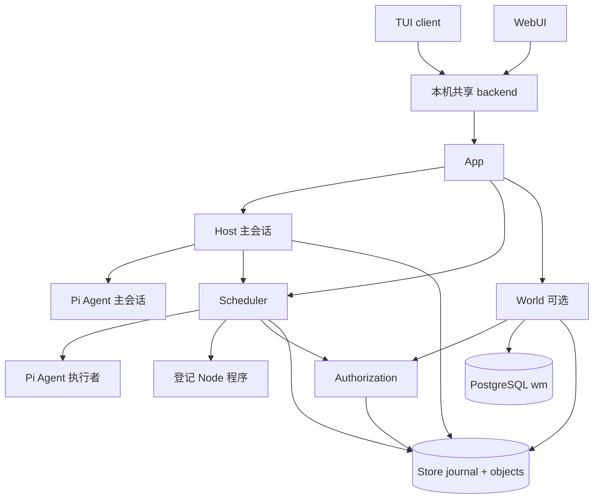

# 当前架构

## 模块与所有权

| 源码（src/pi_secretary/src） | 实际职责 |
| --- | --- |
| app.ts | 打开 Store，恢复授权与任务，创建 Host；pump 协调 World drain、tick、retire、反馈和主会话 |
| host.ts | 接收/领取输入、唯一主会话 loop、工具幂等、反馈承接、工作记忆整理 |
| scheduler.ts | 任务提案、workspace 初始化、触发、前置条件、并发执行、授权后续接、结果和归档 |
| authorization.ts | 操作准备、规则匹配、Master 决定、派发前复核、回执和未知作用恢复 |
| store.ts / lock.py | 契约校验、对象库、JSONL 事务、请求幂等和 OS 文件锁 |
| world.ts | 迁移、World 变更、SQL 事务、证据与 outbox 桥接 |
| model.ts / transport.ts | fixture/live、双角色模型配置、请求/响应持久化 |
| context.ts | 原始上下文、checkpoint、token 预估与来源元数据 |
| memory.ts / instructions.ts / task-prompt.ts | 承诺维护、用户说明、基础 prompt、执行交接协议 |
| backend.ts / ui-client.ts | localhost API、token、客户端状态与自动连接后台 |
| client-tui.ts / tui.ts / web.ts | 终端客户端、共享命令控制器、浏览器入口 |

Web 静态资源在 `src/pi_secretary/web`；人工程序示例在 `src/pi_secretary/examples`。根目录 npm scripts 是统一启动入口。

## Pi 集成

[src/UPSTREAM.json](../src/UPSTREAM.json) 锁定 Pi v0.87.0 和 commit。`src/pi_resource` 是 Git 子模块；Agent、Agent 类型、read/write 工具和 NodeExecutionEnv 直接导入其源码。模型传输依赖相同版本 `@earendil-works/pi-ai`，另使用 Chord 包。Secretary 未把上游整个 CLI 或任意扩展机制作为主会话权限入口。上游自带文档和测试随子模块保留，不是 Secretary 自有 docs/test 分类的副本。

## 运行时关系

一个数据目录由一个后台持有文件锁，多个 TUI/Web 客户端共享该实例。Host 串行处理主会话；任务默认最多两个执行者，任务 Agent 内部工具顺序执行。后台每 300ms pump；不同工作路径通过各自的 busy/running 标记避免重复进入。它不是分布式 worker 队列。

模型模式由 `SECRETARY_MODE` 选择。fixture 使用真实 Agent loop 加固定输出；live 使用 provider。World Model 无数据库配置时返回 UNAVAILABLE，主会话、任务和 JSONL 存储仍可独立运行。
