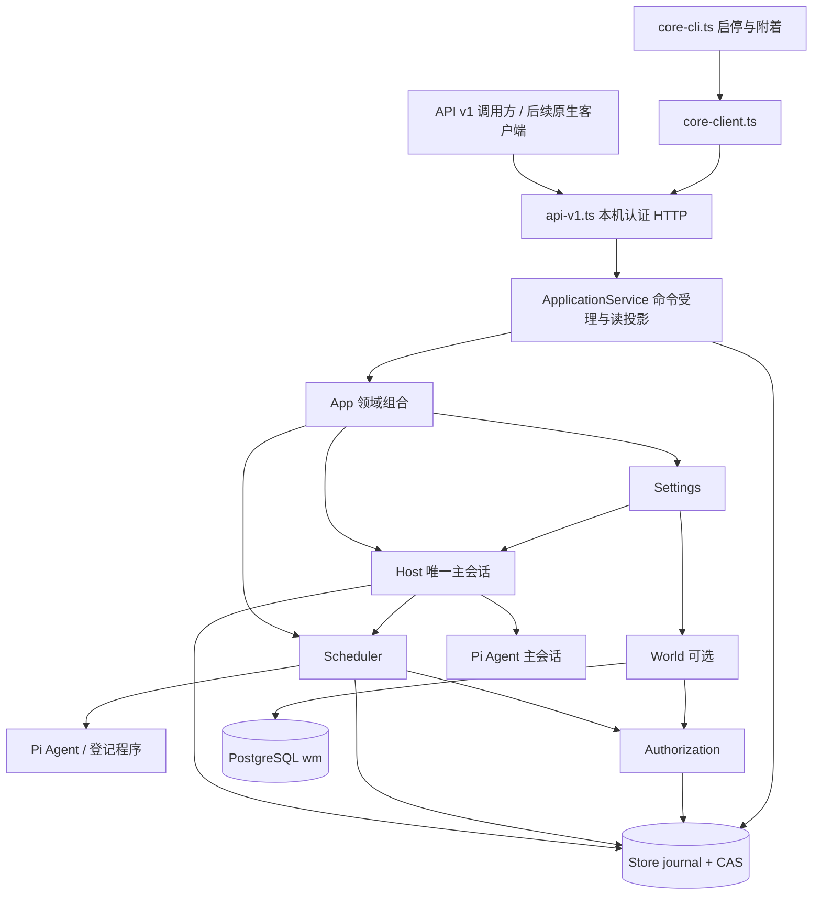

# 当前架构

Core API v1 是当前客户端入口。SwiftUI 尚未实现，旧 TUI/WebUI 的协议已退出当前服务；旧源码及部分领域/渲染测试仍在仓库，不代表存在可用的旧 HTTP 服务。

```mermaid
flowchart TD
  C[API v1 调用方 / 后续原生客户端] --> HTTP[api-v1.ts 本机认证 HTTP]
  CLI[core-cli.ts 启停与附着] --> CLIENT[core-client.ts]
  CLIENT --> HTTP
  HTTP --> AS[ApplicationService 命令受理与读投影]
  AS --> APP[App 领域组合]
  APP --> H[Host 唯一主会话]
  APP --> S[Scheduler]
  APP --> SET[Settings]
  SET --> H
  SET --> W[World 可选]
  H --> M[Pi Agent 主会话]
  H --> S
  S --> TASK[Pi Agent / 登记程序]
  S --> A[Authorization]
  W --> A
  W --> PG[(PostgreSQL wm)]
  H --> ST[(Store journal + CAS)]
  S --> ST
  A --> ST
  AS --> ST
```

## 模块与边界

以下路径相对于 `src/pi_secretary/src`。

| 模块 | 当前职责 |
| --- | --- |
| core-cli.ts / core-client.ts / backend.ts | detached Core 启动、发现文件与唯一 writer 竞争；附着/状态不启动进程，显式停止关闭 Core |
| api-v1.ts | loopback、Host/Origin、Bearer token、JSON/大小门禁、错误封装、产物有界流读取及 300ms pump |
| application-service.ts / api/protocol.ts / api/routes.ts | local-owner 身份、命令校验/幂等/受理、纯查询、分页与公开字段投影；不替代领域状态机 |
| app.ts | 组合 Store、Authorization、Scheduler、Host、Settings 与可选 World；推进与关闭领域工作 |
| host.ts | 输入领取、主会话循环、工具回执、工作记忆、显式恢复 |
| scheduler.ts | 任务/执行身份、workspace、前提、授权后的工具执行、结果/反馈和留存 |
| authorization.ts | 操作准备、规则/审批绑定、派发前复核、回执和未知作用保护 |
| store.ts / lock.py | schema 校验、哈希对象、journal 同帧事务、请求身份索引及 OS 文件锁 |
| settings.ts / settings-memory.ts / settings-payload.ts | 草稿、完整来源整理、World 批次、context 重建和恢复 |
| world.ts | PostgreSQL 迁移、目录/事实分页、事务、版本与 outbox 桥接 |
| model.ts / transport.ts / budget.ts | 双角色模型、fixture/live、请求容量硬门禁、调用原件与响应先持久化 |
| context.ts / memory.ts / summary.ts | 完整恢复上下文、独立请求投影、摘要、承诺来源及确定性校验 |
| preview.ts / activity.ts / activity-history.ts / timeline.ts | 有界临时预览、活动观察、可重建历史索引、时间线窗口与正文分片 |
| instructions.ts / task-prompt.ts | 主会话基本说明与执行协议 |

公开 DTO 来自 [API schema](api/v1/schema.json)，内部持久记录来自 [运行 schema](../src/contracts/contracts.schema.json)，两者独立生成类型。`ApiCommand`、`CoreIdentity`、`AssistantProfile`、`ClientRegistration` 也属于内部持久记录。revision 等大整数在 HTTP 上投影为字符串；CAS 路径、完整 prompt 和凭据不作为公共读模型输出。

## 生命周期与并发

一个数据目录只有一个持锁 Core writer；客户端登记不产生另一套业务会话。Host 串行处理主会话，Scheduler 默认最多两个任务执行者，同一任务最多一个活跃执行；Agent 工具顺序执行。pump 的 busy/running 门禁避免重复推进，但不是分布式队列或远程租约。

HTTP POST 返回 202 只证明持久受理。短命令受理与首个领域变更同帧保存；长命令先 QUEUED，再 RUNNING，成功 COMPLETED。中断或派发异常保持 UNKNOWN，不能自动重发副作用。详情见[状态机](state-machines.md)和[持久化](persistence.md)。

`SECRETARY_MODE=live` 使用实际 provider，其余代码路径使用 fixture。World 未配置时主会话、任务和本地 Store 可运行，World 能力为 not_configured；已配置不代表数据库健康或已迁移。服务器没有设备 principal、上传服务或可靠 ChangeFeed。

## 读模型、预览和时间线

`durableStream` 单消费者观察供应商增量，将可见文本放入内存预览；完整响应写入 ModelCall/Context 成功后才交给 Agent 执行工具。预览最多保留 8 个调用，每调用 128 个块、32768 字符；不投影签名、redacted 内容或工具参数。预览不进入记忆、授权和业务判断，重启丢失临时内容。

当前客户端用 `GET /api/v1/timeline?streaming=true&thinking=true` 显式读取预览与可见思考；默认不返回思考。临时预览和持久消息用 call_id 关联。没有 `/api/stream` 或旧 activity SSE；新版 `sync/stream` 提供可靠事件补发；查询开关不表示改变模型内部推理。

时间线复用 activity-history/timeline 的可重建索引，以稳定消息/事件 ID、排序锚点和 generation 查询。每页最多 200 项且受 1 MiB 页面预算约束；around 定位、正文 opaque cursor、任务/产物/待处理查询各有独立作用域。GET 不续留、不读后标记已读；明确打开执行才提交 viewed。

索引预热和 Store 重放仍随历史增长；单个大 CAS 消息可能先完整读取/解析再分片。列表分页不等于跨存储快照或常数内存扫描。World 使用独立版本，本分支已实现[持久同步水位和恢复](api/v1/sync.md)。

## 任务与证据

TaskPlan 保存计划基线，Execution.proposal_ref 固定本轮要求。同任务接续复用 work 目录，生成新的 Execution；parent_execution_id 和 continuation_of 关联前一轮。TaskResult 的 CAS 产物保持不可变，工作文件可继续修改。模型 submit_result 与 `verified_by=NOT_VERIFIED` 不能代替独立验算，真实产物验收见[验证记录](api/v1/verification.md)。

Host 创建的 Notification 与已读确认不同。旧 TerminalController 曾通过 presented 写入 SENT 回执；当前 Core 不加载该控制器，也没有公共 notification presented 命令。普通时间线查询不会推进该状态；不能宣称已接通旧通知送达流程，依赖 SENT 的自动承诺完成规则仍需真实送达证据。

## Pi 与后续客户端

[src/UPSTREAM.json](../src/UPSTREAM.json) 固定 Pi v0.87.0 与子模块 commit。Agent、read/write 工具、NodeExecutionEnv 使用子模块源码，模型传输包与其版本匹配。上游 CLI/扩展不构成 Secretary 的权限入口，上游文档不属于本仓库自有文档维护范围。

`ui-client.ts`、`client-tui.ts`、`tui.ts`、`web.ts`、`src/pi_secretary/web` 及旧 `.command` 仍是待 #10 清理的遗留实现。SwiftUI 按[客户端规范](native-client-design-v0.3.md)消费新版合同；可选新版 TUI 只保留在开发路线，不维护旧协议兼容层。

## 持久同步投影

SyncService 从 Store 的已提交事务构建可重建资源版本索引；bootstrap 捕获固定 journal 位置，World 独立一致读。SSE 与 HTTP catch-up 共享同一读取循环，投递缓冲有界，读取不写业务状态。NotificationService 原子保存通知和目标 Delivery，ACK 通过原 ApplicationService 幂等入口；原记忆证据校验只接受真实 presented。详见[协议与故障边界](api/v1/sync.md)。
