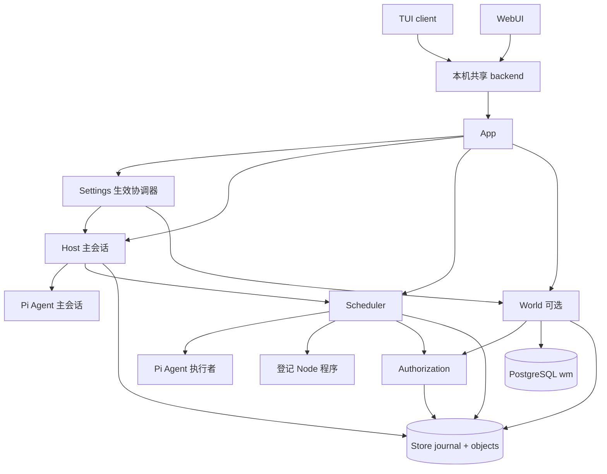

# 当前架构

```mermaid
flowchart TD
  TUI[TUI client] --> B[本机共享 backend]
  WEB[WebUI] --> B
  B --> APP[App]
  APP --> G[Settings 生效协调器]
  G --> H[Host 主会话]
  G --> W[World 可选]
  APP --> H[Host 主会话]
  APP --> S[Scheduler]
  APP --> W[World 可选]
  H --> MAIN[Pi Agent 主会话]
  H --> S
  S --> TASK[Pi Agent 执行者]
  S --> P[登记 Node 程序]
  S --> A[Authorization]
  W --> A
  W --> PG[(PostgreSQL wm)]
  H --> ST[(Store journal + objects)]
  S --> ST
  A --> ST
  W --> ST
```

## 模块与所有权

| 源码（src/pi_secretary/src） | 实际职责 |
| --- | --- |
| app.ts | 打开 Store，恢复授权与任务，创建 Host；pump 协调 World drain、tick、retire、反馈和主会话 |
| host.ts | 接收/领取输入、唯一主会话 loop、工具幂等、反馈承接、工作记忆整理 |
| scheduler.ts | 任务提案、workspace 初始化、触发、前置条件、并发执行、授权后续接、结果和归档 |
| authorization.ts | 操作准备、规则匹配、Master 决定、派发前复核、回执和未知作用恢复 |
| store.ts / lock.py | 契约校验、对象库、JSONL 事务、请求幂等和 OS 文件锁 |
| settings.ts / settings-memory.ts / settings-payload.ts | 草稿、批次生效、完整来源摘要、上下文重建与恢复 |
| world.ts | 迁移、World 变更、SQL 事务、证据与 outbox 桥接 |
| model.ts / transport.ts | fixture/live、双角色模型配置、请求/响应持久化、主会话增量观察 |
| preview.ts | 有界内存预览、正文与可见思考投影、独立版本号 |
| context.ts | 原始上下文、checkpoint、token 预估与来源元数据 |
| memory.ts / instructions.ts / task-prompt.ts | 承诺维护、用户说明、基础 prompt、执行交接协议 |
| backend.ts / ui-client.ts | localhost API、token、客户端状态与自动连接后台 |
| client-tui.ts / tui.ts / web.ts | 终端客户端、共享命令控制器、浏览器入口 |

Web 静态资源在 `src/pi_secretary/web`；人工程序示例在 `src/pi_secretary/examples`。根目录 npm scripts 是统一启动入口。

## Pi 集成

[src/UPSTREAM.json](../src/UPSTREAM.json) 锁定 Pi v0.87.0 和 commit。`src/pi_resource` 是 Git 子模块；Agent、Agent 类型、read/write 工具和 NodeExecutionEnv 直接导入其源码。模型传输依赖相同版本 `@earendil-works/pi-ai`，另使用 Chord 包。Secretary 未把上游整个 CLI 或任意扩展机制作为主会话权限入口。上游自带文档和测试随子模块保留，不是 Secretary 自有 docs/test 分类的副本。

## 运行时关系

一个数据目录由一个后台持有文件锁，多个 TUI/Web 客户端共享该实例。Host 串行处理主会话；任务默认最多两个执行者，任务 Agent 内部工具顺序执行。后台每 300ms pump；不同工作路径通过各自的 busy/running 标记避免重复进入。它不是分布式 worker 队列。

模型模式由 `SECRETARY_MODE` 选择。fixture 使用真实 Agent loop 加固定输出；live 使用 provider。World Model 无数据库配置时返回 UNAVAILABLE，主会话、任务和 JSONL 存储仍可独立运行。

## 主会话流式显示

`durableStream` 对主会话供应商事件保持单消费者，复制到延迟交付 Agent 的事件流，并将可见文本增量发送给 Host 的内存预览。完整响应仍先写入 ModelCall 与 journal，保存成功后 Agent 才能取得响应并执行工具。显示回调失败不改变执行结果；取消或超时会中止等待，保存失败不能放行响应。

预览不参与上下文、授权或任务决策。最多保留 8 个调用，每个调用最多 128 个文本块、32768 个字符；签名、redacted 块、工具参数不投影。按 session、loop、call 和块索引关联，最终 `main.message` 附带显示调用 ID，前端据此替换临时消息而不重复追加。预览只有内存副本，完整历史仍来自持久化消息。

`/api/stream` 使用经过同源、Bearer token 和 client 校验的 SSE，前端通过带 Authorization header 的 fetch 接收；每 100ms 合并发送变化快照、每约 5 秒发送心跳。快照自带独立版本，重连从当前快照继续；客户端不共享消费队列。慢客户端积压超过 512KiB 时断开以便重连，连接关闭清理定时器。`/api/state` 继续以 700ms 轮询更新持久状态、任务和授权。两个接口仅在 `thinking=1` 时投影可见思考字段。

前端按调用或消息 ID 复用节点，保留折叠状态，用户位于底部时才跟随滚动。显示偏好变更会使状态缓存失效，并阻止旧请求把已隐藏的思考重新写入页面；不经过全局 Settings 生效流程。

## 任务身份与执行轮次

主会话可自行推理、分析材料和解释结果；文件操作、外部动作和需要独立执行上下文的工作才交给任务执行者。对同一工作的修改，通过 task_propose 复用 Task 身份，按轮次创建独立 Execution。TaskPlan 保留最初提案与周期安排，Execution 的 proposal_ref 固定本轮目标、约束、验收、前提、截止时间及执行器。恢复旧 Execution 不等于创建接续轮次。

Scheduler 在单次 journal 提交中登记即时请求、回执和 parent 留存保护；tick 在单次提交中消费请求并创建执行。work 目录按 Task 共享，结果、checkpoint 与不可变产物按 Execution 保存。每个 Task 同时最多一个活跃执行或待执行接续；本阶段只接续最新终结执行，不提供历史分支、运行中追加要求或归档恢复。

## 活动观察与双 UI

`activity.ts` 在每个 Store 对象上维护独立的有界观察器，将实时模型/工具/设置步骤与现有业务记录投影成活动集合。各活动按 ID 独立更新和结束；父任务及当前子步骤合并呈现，主会话、设置和后台执行可并列。任务状态仍由 Scheduler、设置状态仍由 Settings 决定，活动数据不写入 journal、不进入模型记忆或授权判定。

`durableStream` 观察真实调用生命周期，Host/Scheduler 在工具去重及执行边界接入。设置检查点提供总段数及完成数，实时观察提供当前段、尝试和承诺提取等子步骤；完整响应先持久化再执行工具的顺序保持不变。后台重启产生新的实例 ID，旧模型调用不会被推断为仍运行。

`GET /api/activity` 提供认证快照，版本由后台实例 ID 与 activity_revision 标识，独立于 Store sequence，并且不等待客户端命令。SSE 请求 `activity=1` 增加 activity 事件，`preview=0` 关闭正文预览；未指定 activity 的旧客户端保持原 preview 协议。无状态变化时复用按 Store/活动版本缓存的投影；设置来源片段只按版本读取数量。实时观察最多 256 条、快照当前活动最多 128 条、近期最多 50 条，快照附带总量与截断标识。

旧 Web 协议支持两类 SSE；第三版 Web 使用下述窗口查询，避免同时保留另一份 SSE 历史。TTY 用 readline 管理多行活动提示及输入光标，非 TTY 仅在活动版本变化时输出。刷新、断线及活动栏操作不会重新触发业务；显示模块不生成重试或授权。错误仅输出固定安全文案，活动文字不作为 HTML 或终端控制序列执行。

Web 的第二版活动时间线由 `activity-history.ts` 从 Store 已验证的事务引用、ModelCall、Context、工具结果、Execution 与维护记录构建。它不从聊天文本推断执行；稳定的来源 ID 将实时观察和持久结果合并，工具请求与结果分开判定，模型调用顺序也用于预览替换后的消息位置。`timeline=1` 为活动 API/SSE 增加历史首屏、实时覆盖和近期持久更新；`/api/activity/history` 提供游标分页（默认 50、上限 100）及至多 50 个指定 ID 的状态刷新，继承现有本地鉴权及会话过滤。

历史活动索引在启动时预热，之后仅处理新增 Store 事务。第三版 `timeline.ts` 引用这些活动元数据，另保存普通消息来源引用与显示顺序，不保存全量正文。`POST /api/timeline` 每页最多 200 项/1 MiB，通过稳定 ID 与排序键二分定位，支持前后查询和定位；当前窗口变化只检查至多 2200 项元数据，无变化时不读旧正文。没有固定成员水位或变更投递队列；实例代际、显示偏好和客户端 generation 防止旧响应混入新窗口。

新版 `/api/state?window=1` 不调用旧 `conversation()`，也不返回任务/授权详情；面板通过 `/api/panels` 按需一次取 20 项，复用 Store 类型索引及历史归属。兼容的旧 `/api/state` 仍全量返回，保留旧客户端成本。Web 默认缓存最多 2000 项/16 MiB 序列化内容并只挂载视口附近至多 150 项；这是实现参数而非普通消息与活动必须共用的业务额度。未变化时闲置查询约 5 秒一次，有活动约 700ms；后台页时间线约 30 秒。大正文保留一个有界片段，通过前后内容入口读取全文。

没有新增服务、数据库、持久化格式或 PostgreSQL 查询。Store 重放、全历史元数据与首次索引仍随历史增长；单个大 CAS 消息仍要完整读取/解析再返回片段。任务面板按需查询可能扫描该类型内存元数据，但只克隆有界结果，不逐条读取历史正文。测量及边界见[第三版报告](../test_case/reports/timeline-window-20261005/README.md)，第二版基线保留在[原报告](../test_case/reports/activity-timeline-20261005/README.md)。
