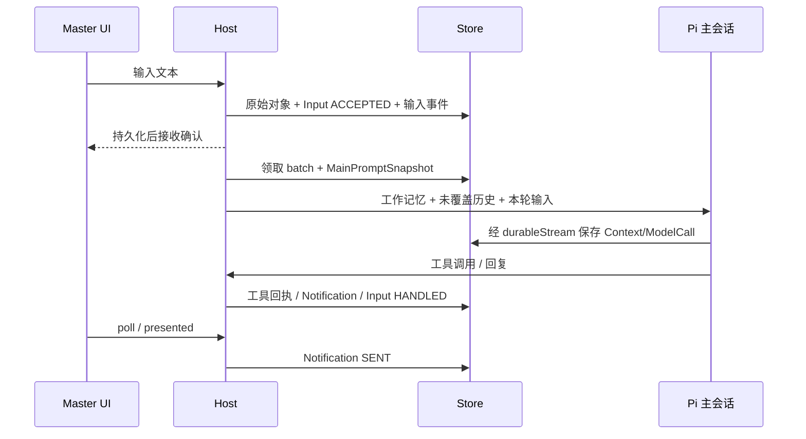
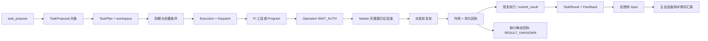

# 数据流

## 输入与主会话

`SENT` 表示 UI 展示回报，不是 Master 已理解内容的证明。工具日志和摘要不被作为新的 Master 输入来源。

## 任务与作用

提案的 goal、constraints、acceptance_criteria、materials 和 continuation 形成执行协议。材料标为不可信任务数据。结果的 artifacts 指向已保存对象；workspace 中工作文件仍可变。工具输出不等于独立验收。

## 记忆与知识

Consciousness 整理读取旧事项、原始输入/事件、任务状态和承诺，产生候选摘要；提交前检查版本和输入边界。成功更新覆盖游标，失败保留原记忆及未覆盖原文。

World 变更先持久化 WorldCommand/Operation，批准后执行 PostgreSQL 事务。事务写 change_receipt 与 audit_outbox；drain 将数据库事实提交回执桥接到 journal，再标记 outbox 已导出。这是两个持久化域的可恢复桥接，不是跨数据库和文件系统的原子事务。

实现依据：[host.ts](../src/pi_secretary/src/host.ts)、[scheduler.ts](../src/pi_secretary/src/scheduler.ts)、[world.ts](../src/pi_secretary/src/world.ts)。
