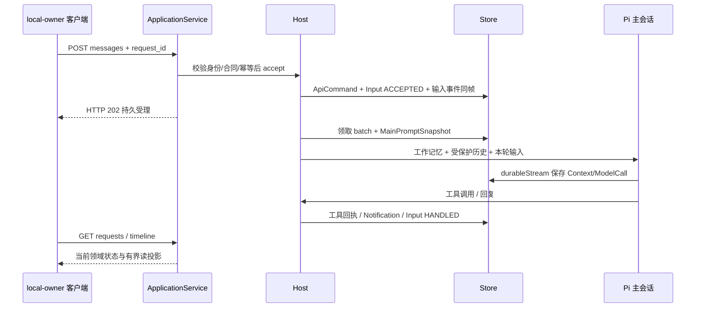
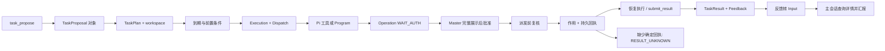

# 数据流

## 输入与主会话

```mermaid
sequenceDiagram
  participant C as local-owner 客户端
  participant A as ApplicationService
  participant H as Host
  participant S as Store
  participant M as Pi 主会话
  C->>A: POST messages + request_id
  A->>H: 校验身份/合同/幂等后 accept
  H->>S: ApiCommand + Input ACCEPTED + 输入事件同帧
  A-->>C: HTTP 202 持久受理
  H->>S: 领取 batch + MainPromptSnapshot
  H->>M: 工作记忆 + 受保护历史 + 本轮输入
  M->>S: durableStream 保存 Context/ModelCall
  M->>H: 工具调用 / 回复
  H->>S: 工具回执 / Notification / Input HANDLED
  C->>A: GET requests / timeline
  A-->>C: 当前领域状态与有界读投影
```

GET 不表示展示/已读，不写 Notification SENT。旧 TerminalController 的 presented 回执仍有领域代码，但新版 Core 不加载它；新版通过 deliveries/{id}/ack 显式记录各目标的 received/presented/read。工具日志和摘要不能冒充新的 Master 输入。

## 任务与作用

```mermaid
flowchart LR
  A[task_propose] --> B[TaskProposal 对象]
  B --> C[TaskPlan + workspace]
  C --> D[到期与前置条件]
  D --> E[Execution + Dispatch]
  E --> F[Pi 工具或 Program]
  F --> G[Operation WAIT_AUTH]
  G --> H[Master 完整展示后批准]
  H --> I[派发前复核]
  I --> J[作用 + 持久回执]
  J --> K[恢复执行 / submit_result]
  K --> L[TaskResult + Feedback]
  L --> M[反馈转 Input]
  M --> N[主会话查询详情并汇报]
  J --> U[缺少确定回执: RESULT_UNKNOWN]
```

提案的 goal、constraints、acceptance_criteria、materials 和 continuation 形成执行协议。材料标为不可信任务数据。结果的 artifacts 指向已保存对象；workspace 中工作文件仍可变。工具输出不等于独立验收。

## 记忆与知识

Consciousness 整理读取旧事项、原始输入/事件、任务状态和承诺，产生候选摘要；提交前检查版本和输入边界。成功更新覆盖游标，失败保留原记忆及未覆盖原文。

模型 World 提案先持久化 WorldCommand/Operation，批准后进入 Settings 协调器。经认证 local-owner 通过 settings/draft 保存草稿，settings/apply 记录明确的 Master 证据；两种入口均在完整摘要和 context 容量检查后执行 PostgreSQL 批次事务。事务写 change_receipt 与 audit_outbox；drain 将数据库事实提交回执桥接到 journal，再标记 outbox 已导出。这是两个持久化域的可恢复桥接，不是跨数据库和文件系统的原子事务。

实现依据：[host.ts](../src/pi_secretary/src/host.ts)、[scheduler.ts](../src/pi_secretary/src/scheduler.ts)、[world.ts](../src/pi_secretary/src/world.ts)。

## 已完成任务的接续

Master 补充要求 → Host 发现/查询原 Task → task_propose(reuse_task_id, parent_execution_id) → Scheduler 校验最新 parent、执行空闲、资料和 workspace → 固定有效提案 → 同一 journal 提交回执、pending_requests 与 parent 保护 → tick 原子消费并创建带 proposal_ref 的新 Execution → 现有授权与执行流程 → 保存新结果和不可变产物 → 释放 parent 保护并反馈。

重复请求先重放回执，不能因已受理后任务繁忙而拒绝原请求。普通结果解释由主会话直接处理；新独立交付创建新 Task，parent-only 仍是新任务引用旧材料。

## 产物与公开读取

write/bash 或程序产生任务工作文件 → submit_result 指定文件 → Scheduler 读取并保存 CAS → TaskResult 绑定 artifact_id/task/execution → ApplicationService 建立目录索引 → API 元信息与内容下载 → 调用方独立验证。shell 的 Operation.resource 是 cwd，生成文件的 producing_operation_id 可以为空；来源验证须结合执行作用域、获批代码/命令和成功回执。

公开详情只返回产物 ID 与读模型，不能直接访问任意工作路径。下载先校验已知 CAS 引用、文件类型、长度及散列，再流式返回。HTTP 成功、模型结果与独立内容验算是不同证据层；实现验证见[产物验收](api/v1/verification.md)。

## API 长命令

POST 持久登记 ApiCommand QUEUED → 返回 202 → 调度为 RUNNING → 调用原领域入口 → COMPLETED 或 UNKNOWN。重启只推进未开始的 QUEUED；已 RUNNING 的中断转 UNKNOWN，不自动重发。memory/recovery 仍须通过当前实例的票据有效期及来源绑定，API 持久受理不会延长授权。
