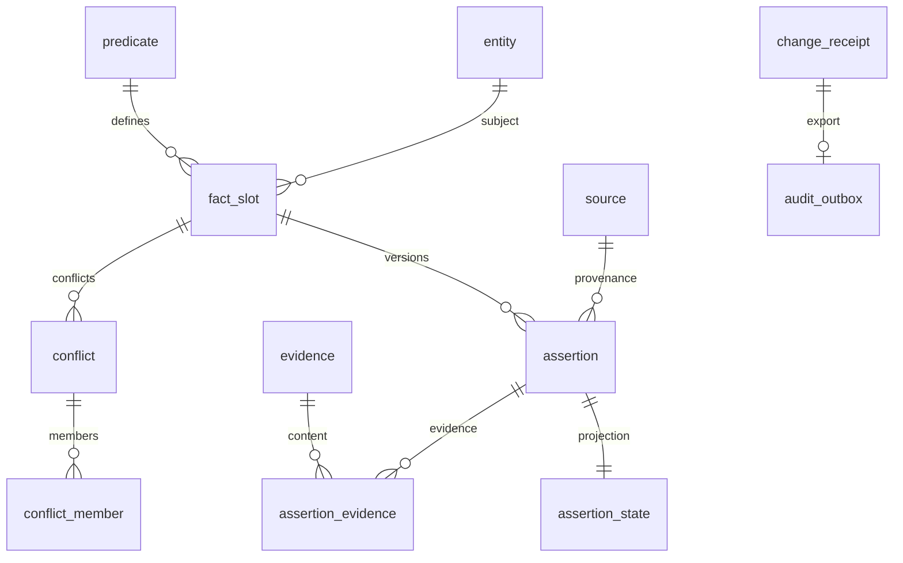

# PostgreSQL schema

当前 World Model 使用 `wm` schema；Session、Task、授权规则、Context 与 Consciousness 存储在本地 journal，不是 PostgreSQL 表。

权威 SQL：[001_world_model.sql](../src/schema/001_world_model.sql)、[002_predicates.sql](../src/schema/002_predicates.sql)、[queries.sql](../src/schema/queries.sql)。执行仓储：[world.ts](../src/pi_secretary/src/world.ts)。

## 迁移与事务

World.migrate 使用 advisory lock 串行化迁移；不存在 schema_version 时执行基线，再应用 predicate seed 并记录版本 2。基线/seed 自带事务；migrate 在失败时 rollback 并释放锁。仅显式 --migrate / API 调用迁移。

变更先验证内容、证据和授权，再在数据库事务中检查实体、predicate 与 slot revision。change_id/request_id/request_hash 支持回执去重和冲突检查。assertion、状态投影、冲突、证据、change_receipt 与 audit_outbox 在事务中提交；JSONL 审计导出属于独立可恢复桥接。

## 关系图



## 表字段与约束

以下定义直接从当前 SQL 生成，保留默认值、外键、CHECK、UNIQUE 与延迟约束，避免字段文档和 DDL 漂移。

### wm.schema_version

```sql
version integer PRIMARY KEY CHECK (version > 0),
    installed_at timestamptz NOT NULL DEFAULT now()
```

### wm.entity

```sql
entity_id uuid PRIMARY KEY,
    kind text NOT NULL CHECK (kind IN ('PERSON','ORGANIZATION','PROJECT','DEVICE','SERVICE','RESOURCE','GOAL')),
    display_name text NOT NULL CHECK (length(display_name)>0),
    external_key text UNIQUE,
    revision bigint NOT NULL DEFAULT 1 CHECK (revision>0),
    retired_at timestamptz,
    created_at timestamptz NOT NULL DEFAULT now(),
    updated_at timestamptz NOT NULL DEFAULT now()
```

### wm.source

```sql
source_id uuid PRIMARY KEY,
    kind text NOT NULL CHECK (kind IN ('MASTER','OBSERVATION','TASK_REPORT','MODEL_INFERENCE')),
    source_key text NOT NULL UNIQUE,
    description text NOT NULL,
    retired_at timestamptz
```

### wm.predicate

```sql
predicate_key text PRIMARY KEY CHECK (predicate_key ~ '^[a-z][a-z0-9_.]+$'),
    description text NOT NULL,
    subject_kinds text[] NOT NULL CHECK (cardinality(subject_kinds)>0),
    value_type text NOT NULL CHECK (value_type IN ('STRING','NUMBER','BOOLEAN','OBJECT','ARRAY','ENTITY')),
    cardinality text NOT NULL CHECK (cardinality IN ('SINGLE','MULTI')),
    unit text,
    value_schema jsonb NOT NULL CHECK (jsonb_typeof(value_schema)='object'),
    definition_revision bigint NOT NULL DEFAULT 1 CHECK (definition_revision>0)
```

### wm.fact_slot

```sql
slot_id uuid PRIMARY KEY,
    subject_id uuid NOT NULL REFERENCES wm.entity(entity_id),
    predicate_key text NOT NULL REFERENCES wm.predicate(predicate_key),
    scope_key text NOT NULL DEFAULT '',
    revision bigint NOT NULL DEFAULT 0 CHECK (revision>=0),
    UNIQUE(subject_id,predicate_key,scope_key)
```

### wm.change_receipt

```sql
change_id uuid PRIMARY KEY,
    request_id uuid NOT NULL UNIQUE,
    request_hash text NOT NULL CHECK (request_hash ~ '^[0-9a-f]{64}$'),
    outcome text NOT NULL CHECK (outcome IN ('APPLIED','CONFLICT','REJECTED')),
    result jsonb NOT NULL CHECK (jsonb_typeof(result)='object'),
    committed_at timestamptz NOT NULL DEFAULT now()
```

### wm.assertion

```sql
assertion_id uuid PRIMARY KEY,
    slot_id uuid NOT NULL REFERENCES wm.fact_slot(slot_id),
    slot_revision bigint NOT NULL CHECK (slot_revision>0),
    source_id uuid NOT NULL REFERENCES wm.source(source_id),
    change_id uuid NOT NULL REFERENCES wm.change_receipt(change_id) DEFERRABLE INITIALLY DEFERRED,
    value jsonb,
    object_entity_id uuid REFERENCES wm.entity(entity_id),
    epistemic text NOT NULL CHECK (epistemic IN ('OBSERVED','REPORTED','INFERRED','UNRESOLVED')),
    observed_at timestamptz,
    received_at timestamptz NOT NULL,
    valid_from timestamptz NOT NULL,
    valid_to timestamptz,
    fresh_until timestamptz,
    scope_description text NOT NULL CHECK (length(scope_description)>0),
    replaces_assertion_id uuid,
    UNIQUE(assertion_id,slot_id),
    UNIQUE(slot_id,slot_revision),
    FOREIGN KEY(replaces_assertion_id,slot_id) REFERENCES wm.assertion(assertion_id,slot_id),
    CHECK ((value IS NOT NULL AND value <> 'null'::jsonb AND object_entity_id IS NULL)
        OR (value IS NULL AND object_entity_id IS NOT NULL)),
    CHECK (valid_to IS NULL OR valid_to>valid_from),
    CHECK (fresh_until IS NULL OR fresh_until>=valid_from),
    CHECK (epistemic<>'OBSERVED' OR observed_at IS NOT NULL),
    CHECK (replaces_assertion_id IS NULL OR replaces_assertion_id<>assertion_id)
```

### wm.assertion_state

```sql
assertion_id uuid PRIMARY KEY,
    slot_id uuid NOT NULL,
    status text NOT NULL CHECK (status IN ('ACTIVE','SUPPORTING','CONTESTED','RETRACTED','SUPERSEDED')),
    revision bigint NOT NULL DEFAULT 1 CHECK (revision>0),
    changed_by uuid NOT NULL REFERENCES wm.change_receipt(change_id) DEFERRABLE INITIALLY DEFERRED,
    changed_at timestamptz NOT NULL DEFAULT now(),
    FOREIGN KEY(assertion_id,slot_id) REFERENCES wm.assertion(assertion_id,slot_id)
```

### wm.evidence

```sql
evidence_id uuid PRIMARY KEY,
    log_event_id uuid NOT NULL,
    object_path text NOT NULL CHECK (object_path !~ '(^/|(^|/)\.\.(/|$))'),
    sha256 text NOT NULL CHECK (sha256 ~ '^[0-9a-f]{64}$'),
    media_type text NOT NULL,
    byte_count bigint NOT NULL CHECK (byte_count>=0),
    UNIQUE(log_event_id,sha256)
```

### wm.assertion_evidence

```sql
assertion_id uuid NOT NULL REFERENCES wm.assertion(assertion_id),
    evidence_id uuid NOT NULL REFERENCES wm.evidence(evidence_id),
    PRIMARY KEY(assertion_id,evidence_id)
```

### wm.conflict

```sql
conflict_id uuid PRIMARY KEY,
    slot_id uuid NOT NULL REFERENCES wm.fact_slot(slot_id),
    status text NOT NULL CHECK (status IN ('OPEN','RESOLVED')),
    opened_by uuid NOT NULL REFERENCES wm.change_receipt(change_id) DEFERRABLE INITIALLY DEFERRED,
    resolved_by uuid REFERENCES wm.change_receipt(change_id) DEFERRABLE INITIALLY DEFERRED,
    resolution_note text,
    UNIQUE(conflict_id,slot_id),
    CHECK ((status='OPEN' AND resolved_by IS NULL AND resolution_note IS NULL)
       OR (status='RESOLVED' AND resolved_by IS NOT NULL AND resolution_note IS NOT NULL AND length(resolution_note)>0))
```

### wm.conflict_member

```sql
conflict_id uuid NOT NULL,
    slot_id uuid NOT NULL,
    assertion_id uuid NOT NULL,
    PRIMARY KEY(conflict_id,assertion_id),
    FOREIGN KEY(conflict_id,slot_id) REFERENCES wm.conflict(conflict_id,slot_id),
    FOREIGN KEY(assertion_id,slot_id) REFERENCES wm.assertion(assertion_id,slot_id)
```

### wm.audit_outbox

```sql
event_id uuid PRIMARY KEY,
    change_id uuid NOT NULL UNIQUE REFERENCES wm.change_receipt(change_id),
    payload jsonb NOT NULL CHECK (jsonb_typeof(payload)='object'),
    created_at timestamptz NOT NULL DEFAULT now(),
    exported_journal_txn uuid,
    exported_at timestamptz,
    CHECK ((exported_journal_txn IS NULL)=(exported_at IS NULL))
```

## 索引、触发器与读模型

assertion_state 以部分唯一索引保证每个 slot 至多一个 ACTIVE；conflict 每个 slot 至多一个 OPEN。来源/slot 时间索引支持事实读取，pending_audit_exports 支持未导出事件扫描。

validate_slot 检查 subject kind 与 SINGLE/MULTI 的 scope_key；validate_assertion 检查 slot revision、值类型与 ENTITY 引用。assertion、receipt、evidence 及证据关联禁止修改删除；source 身份字段不可改；延迟触发器要求每条 assertion 有证据。更正与撤回通过新的变更和投影表达。

SQL 本身不是全部业务守卫：World 仓储还用 Ajv 验证 predicate.value_schema、检查证据对象和 CAS；不能仅根据表约束宣称所有语义已验证。queries.sql 返回当前投影、冲突、来源及有效性信息，缺失和冲突保留，不用模型猜测补全。

## Predicate 初始目录

初始十项：person.display_name、person.height、person.contact、person.member_of、preference.statement、goal.statement、project.constraint、resource.location、resource.depends_on、resource.observed_state。类型、基数、单位和 JSON 值约束以 002_predicates.sql 为准。关系型字段不代表已经接入社交软件或仓库同步。

## 部署边界

DDL 撤销 PUBLIC 权限，但不创建完整部署角色、认证策略或运维备份系统；连接角色由部署者配置。不得把本机授权规则当作数据库行级权限。首次启用应使用专用数据库。
