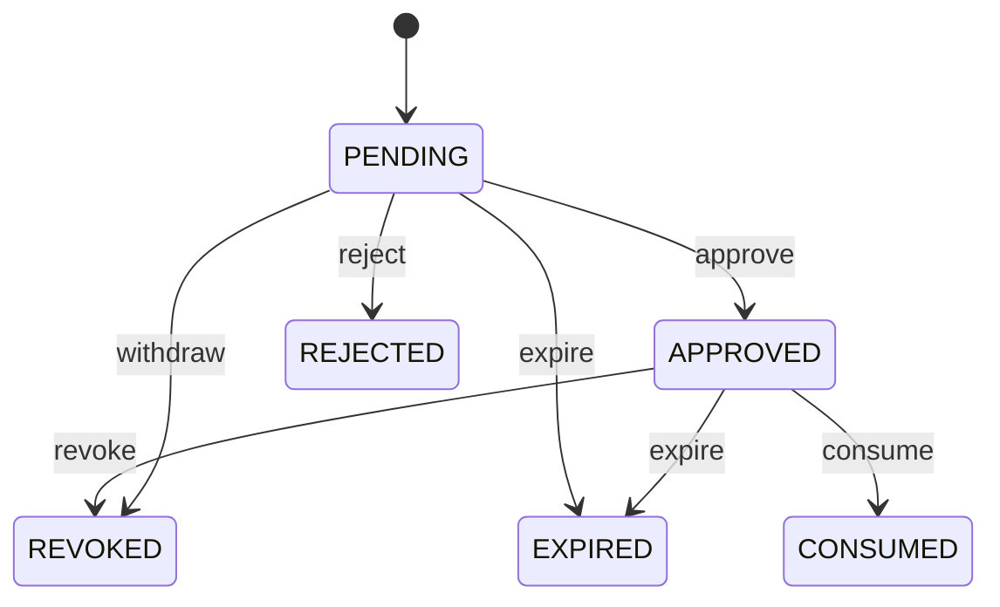

> 历史归档：设计阶段的原始设计或早期实现说明，和当前代码不构成证据对应。命令、路径与结论仅供历史追溯；当前入口见 [项目文档](../../README.md)。

# Authorization 状态机

管理方：`scheduler.authorization`。初态：`PENDING`。终态：REJECTED, REVOKED, EXPIRED, CONSUMED。

状态值与 JSON 契约一致；未列出的转换拒绝。重复事件按 request/event ID 返回旧回执，不能重复执行动作。guards 的具体含义见 [GUARDS.md](GUARDS.md)。

| 转换 ID | 前态 + 事件 → 后态 | 前置条件 | 同步持久化结果 |
| --- | --- | --- | --- |
| Authorization-01 | PENDING + approve → APPROVED | `master_ui_and_scope_match` | 持久化批准 |
| Authorization-02 | PENDING + reject → REJECTED | `master_ui` | 持久化拒绝 |
| Authorization-03 | PENDING + expire → EXPIRED | `deadline_elapsed` | 撤下有效请求 |
| Authorization-04 | APPROVED + revoke → REVOKED | `master_ui` | 阻止未分派操作 |
| Authorization-05 | APPROVED + expire → EXPIRED | `deadline_elapsed` | 禁止消费 |
| Authorization-06 | APPROVED + consume → CONSUMED | `final_gate` | 与 Operation.DISPATCHED 同事务 |
| Authorization-07 | PENDING + withdraw → REVOKED | `scope_changed` | 操作取消或对象改变，请求作废 |
