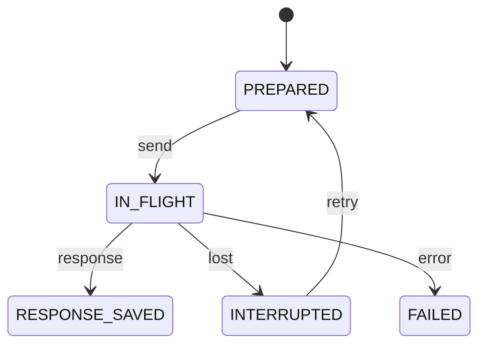

> 历史归档：设计阶段的原始设计或早期实现说明，和当前代码不构成证据对应。命令、路径与结论仅供历史追溯；当前入口见 [项目文档](../../README.md)。

# Call 状态机

管理方：`host/executor`。初态：`PREPARED`。终态：RESPONSE_SAVED, FAILED。

状态值与 JSON 契约一致；未列出的转换拒绝。重复事件按 request/event ID 返回旧回执，不能重复执行动作。guards 的具体含义见 [GUARDS.md](GUARDS.md)。

| 转换 ID | 前态 + 事件 → 后态 | 前置条件 | 同步持久化结果 |
| --- | --- | --- | --- |
| Call-01 | PREPARED + send → IN_FLIGHT | `context_durable` | 记录发送意图 |
| Call-02 | IN_FLIGHT + response → RESPONSE_SAVED | `complete_response` | 保存完整原始响应 |
| Call-03 | IN_FLIGHT + lost → INTERRUPTED | `no_complete_response` | 不执行部分输出 |
| Call-04 | INTERRUPTED + retry → PREPARED | `no_tools_from_partial` | 同 context 新 transport_attempt；不重放工具 |
| Call-05 | IN_FLIGHT + error → FAILED | `definitive_error` | 保存明确失败 |
