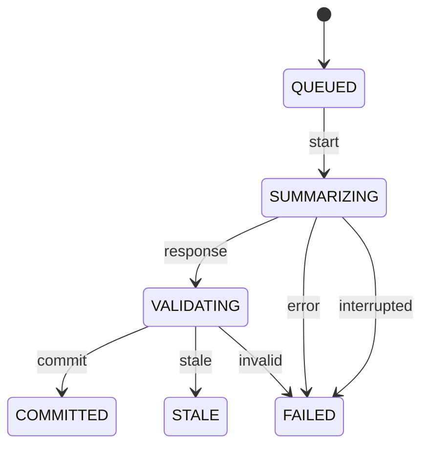

> 历史归档：设计阶段的原始设计或早期实现说明，和当前代码不构成证据对应。命令、路径与结论仅供历史追溯；当前入口见 [项目文档](../../README.md)。

# Compaction 状态机

管理方：`consciousness`。初态：`QUEUED`。终态：COMMITTED, STALE, FAILED。

状态值与 JSON 契约一致；未列出的转换拒绝。重复事件按 request/event ID 返回旧回执，不能重复执行动作。guards 的具体含义见 [GUARDS.md](GUARDS.md)。

| 转换 ID | 前态 + 事件 → 后态 | 前置条件 | 同步持久化结果 |
| --- | --- | --- | --- |
| Compaction-01 | QUEUED + start → SUMMARIZING | `one_job_and_fixed_source` | 固定 base_revision 和原文引用 |
| Compaction-02 | SUMMARIZING + response → VALIDATING | `complete_response` | 保存候选摘要 |
| Compaction-03 | SUMMARIZING + error → FAILED | `known_failure` | 原文保留 |
| Compaction-04 | VALIDATING + commit → COMMITTED | `base_and_coverage_valid` | 一次事务保存新 Consciousness 与承接集合 |
| Compaction-05 | VALIDATING + stale → STALE | `base_changed` | 保留原文，后续新 job |
| Compaction-06 | VALIDATING + invalid → FAILED | `validation_failed` | 保留原文 |
| Compaction-07 | SUMMARIZING + interrupted → FAILED | `no_complete_response` | 保留原文；重新建立固定范围 job |
