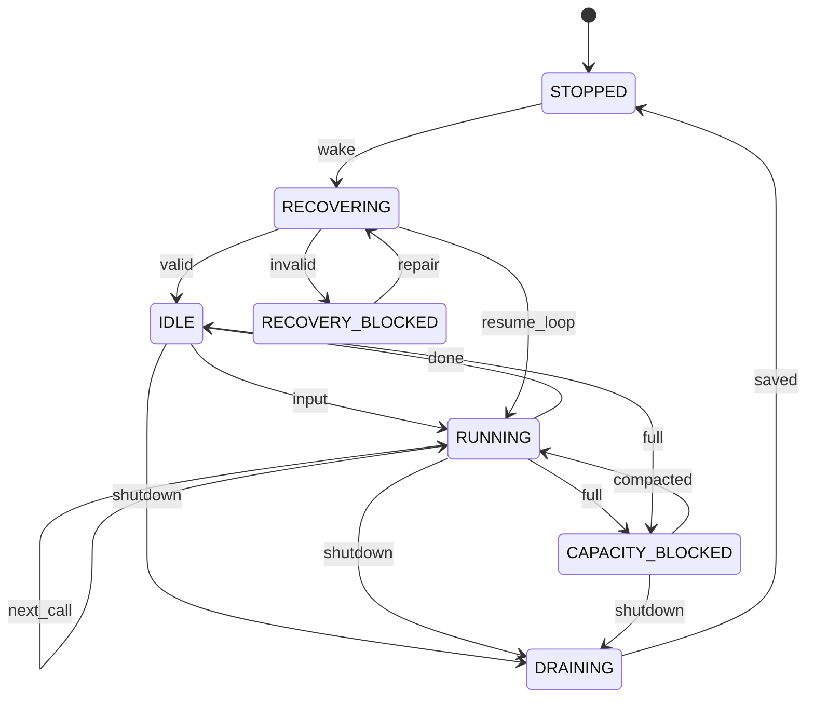

> 历史归档：设计阶段的原始设计或早期实现说明，和当前代码不构成证据对应。命令、路径与结论仅供历史追溯；当前入口见 [项目文档](../../README.md)。

# Host 状态机

管理方：`host`。初态：`STOPPED`。终态：无永久终态，按生命周期恢复。

状态值与 JSON 契约一致；未列出的转换拒绝。重复事件按 request/event ID 返回旧回执，不能重复执行动作。guards 的具体含义见 [GUARDS.md](GUARDS.md)。

| 转换 ID | 前态 + 事件 → 后态 | 前置条件 | 同步持久化结果 |
| --- | --- | --- | --- |
| Host-01 | STOPPED + wake → RECOVERING | `exclusive_owner` | 复用应用持有的独占锁和 owner_epoch；仅应用重新取得所有权时递增 epoch |
| Host-02 | RECOVERING + valid → IDLE | `recovery_complete` | 重放 journal；核对中断操作 |
| Host-03 | RECOVERING + invalid → RECOVERY_BLOCKED | `missing_or_corrupt` | 保存恢复故障；不创建空会话 |
| Host-04 | RECOVERY_BLOCKED + repair → RECOVERING | `operator_repaired` | 重新验证完整记录 |
| Host-05 | IDLE + input → RUNNING | `pending_input_and_capacity` | 原子认领输入并创建 loop_id |
| Host-06 | RUNNING + input → RUNNING | `valid_new_input` | 只追加可靠 inbox，不并发 loop |
| Host-07 | RUNNING + next_call → RUNNING | `call_checkpoint_safe` | 保存本轮调用和工具交互 |
| Host-08 | RUNNING + done → IDLE | `loop_effects_recorded` | 输入标 HANDLED；未认领输入不清空 |
| Host-09 | RUNNING + full → CAPACITY_BLOCKED | `cannot_fit_context` | 保留原文和本轮进度 |
| Host-10 | CAPACITY_BLOCKED + compacted → RUNNING | `context_fits` | 已有 loop 从持久化调用边界继续；尚无认领批次则原子认领待输入再调用 |
| Host-11 | IDLE + shutdown → DRAINING | `no_active_loop` | 停止新调用 |
| Host-12 | RUNNING + shutdown → DRAINING | `checkpoint_requested` | 等待安全交互边界 |
| Host-13 | CAPACITY_BLOCKED + shutdown → DRAINING | `checkpoint_saved` | 保存未完成 loop |
| Host-14 | DRAINING + saved → STOPPED | `all_owned_state_durable` | 退出模型宿主；Scheduler 可继续运行 |
| Host-15 | RECOVERING + resume_loop → RUNNING | `same_loop_checkpoint` | 恢复已认领 loop；只处理尚未完成交互 |
| Host-16 | IDLE + full → CAPACITY_BLOCKED | `cannot_fit_context` | 待输入仍 ACCEPTED，保留准备中的 loop 标识 |
