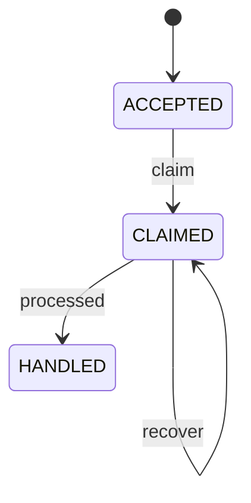

> 历史归档：设计阶段的原始设计或早期实现说明，和当前代码不构成证据对应。命令、路径与结论仅供历史追溯；当前入口见 [项目文档](../../README.md)。

# Input 状态机

管理方：`host`。初态：`ACCEPTED`。终态：HANDLED。

状态值与 JSON 契约一致；未列出的转换拒绝。重复事件按 request/event ID 返回旧回执，不能重复执行动作。guards 的具体含义见 [GUARDS.md](GUARDS.md)。

| 转换 ID | 前态 + 事件 → 后态 | 前置条件 | 同步持久化结果 |
| --- | --- | --- | --- |
| Input-01 | ACCEPTED + claim → CLAIMED | `single_loop` | 保存 loop_id |
| Input-02 | CLAIMED + processed → HANDLED | `response_and_effects_durable` | 提交本批输入处理回执 |
| Input-03 | CLAIMED + recover → CLAIMED | `same_loop_checkpoint` | 续接同一 loop，禁止重新从头执行工具 |
