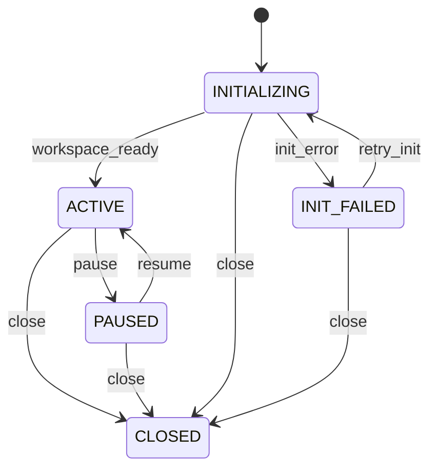

> 历史归档：设计阶段的原始设计或早期实现说明，和当前代码不构成证据对应。命令、路径与结论仅供历史追溯；当前入口见 [项目文档](../../README.md)。

# Plan 状态机

管理方：`scheduler`。初态：`INITIALIZING`。终态：CLOSED。

状态值与 JSON 契约一致；未列出的转换拒绝。重复事件按 request/event ID 返回旧回执，不重复执行。守卫见 [GUARDS.md](GUARDS.md)。

| 转换 ID | 前态 + 事件 → 后态 | 前置条件 | 同步持久化结果 |
| --- | --- | --- | --- |
| Plan-01 | INITIALIZING + workspace_ready → ACTIVE | `workspace_verified` | 目录就绪；可供触发 |
| Plan-02 | INITIALIZING + init_error → INIT_FAILED | `known_error` | 记录目录错误 |
| Plan-03 | INIT_FAILED + retry_init → INITIALIZING | `same_task_id` | 不分配第二个任务 |
| Plan-04 | ACTIVE + pause → PAUSED | `control_authorized` | 停止新增触发分派 |
| Plan-05 | PAUSED + resume → ACTIVE | `control_authorized` | 恢复触发 |
| Plan-06 | ACTIVE + close → CLOSED | `no_future_occurrence` | 关闭计划；不改写执行 |
| Plan-07 | PAUSED + close → CLOSED | `control_authorized` | 关闭计划 |
| Plan-08 | INITIALIZING + close → CLOSED | `control_authorized` | 停止初始化并关闭计划；已产生目录留存归属记录 |
| Plan-09 | INIT_FAILED + close → CLOSED | `control_authorized` | 关闭不再重试的初始化失败计划 |
