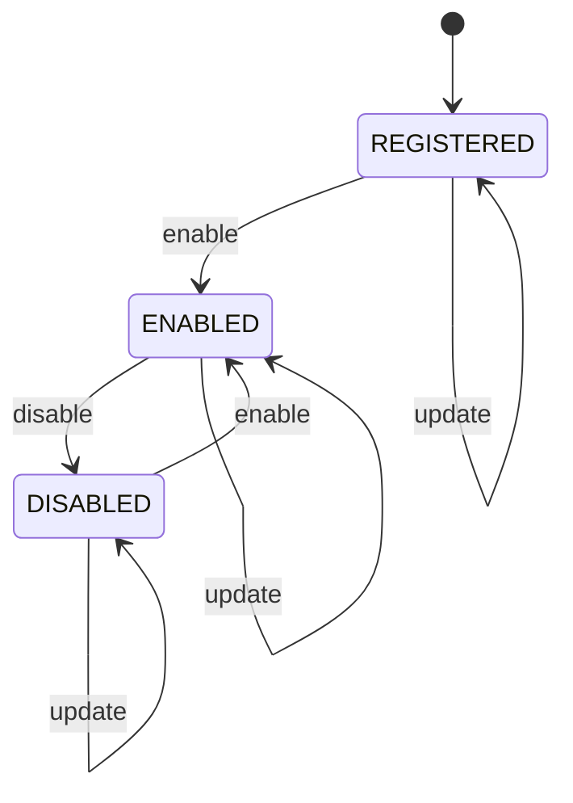

> 历史归档：设计阶段的原始设计或早期实现说明，和当前代码不构成证据对应。命令、路径与结论仅供历史追溯；当前入口见 [项目文档](../../README.md)。

# Program 状态机

管理方：`registry`。初态：`REGISTERED`。终态：无永久终态。

状态值与 JSON 契约一致；未列出的转换拒绝。重复事件按 request/event ID 返回旧回执，不重复执行。守卫见 [GUARDS.md](GUARDS.md)。

| 转换 ID | 前态 + 事件 → 后态 | 前置条件 | 同步持久化结果 |
| --- | --- | --- | --- |
| Program-01 | REGISTERED + enable → ENABLED | `human_validated` | 固化登记 revision 和代码摘要 |
| Program-02 | ENABLED + disable → DISABLED | `human_control` | 停止新分派，运行者不自动停止 |
| Program-03 | DISABLED + enable → ENABLED | `human_validated` | 重新启用 |
| Program-04 | ENABLED + update → ENABLED | `human_validated` | 新 revision；分派前再检查 |
| Program-05 | DISABLED + update → DISABLED | `human_validated` | 新 revision 保持禁用 |
| Program-06 | REGISTERED + update → REGISTERED | `human_validated` | 人工修订未启用的登记版本 |
