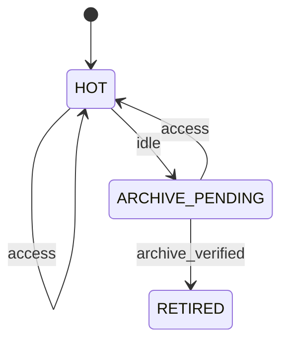

> 历史归档：设计阶段的原始设计或早期实现说明，和当前代码不构成证据对应。命令、路径与结论仅供历史追溯；当前入口见 [项目文档](../../README.md)。

# Retention 状态机

管理方：`scheduler`。初态：`HOT`。终态：RETIRED。

状态值与 JSON 契约一致；未列出的转换拒绝。重复事件按 request/event ID 返回旧回执，不能重复执行动作。guards 的具体含义见 [GUARDS.md](GUARDS.md)。

| 转换 ID | 前态 + 事件 → 后态 | 前置条件 | 同步持久化结果 |
| --- | --- | --- | --- |
| Retention-01 | HOT + access → HOT | `targeted_detail_or_followup` | 刷新 last_activity_at，列表不刷新 |
| Retention-02 | HOT + idle → ARCHIVE_PENDING | `terminal_no_pending_and_ttl` | 冻结退出候选 |
| Retention-03 | ARCHIVE_PENDING + access → HOT | `before_retirement_commit` | 撤销退出候选并刷新 |
| Retention-04 | ARCHIVE_PENDING + archive_verified → RETIRED | `logs_objects_durable_and_no_pending` | 移除短期查询能力；保留索引墓碑 |
