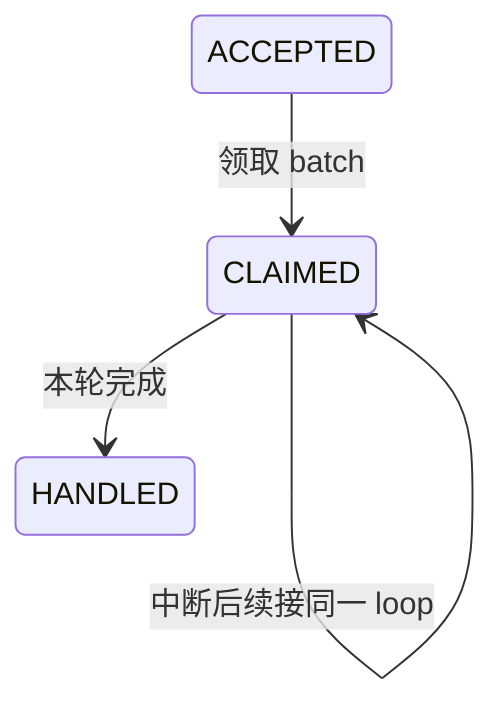
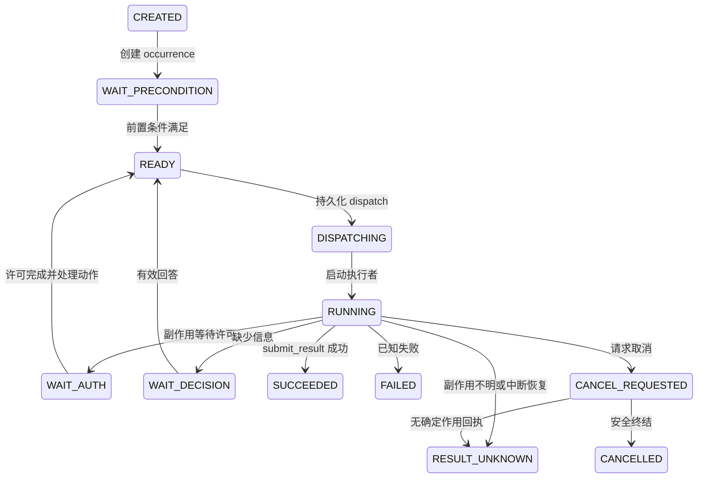

# 状态机与实际流转

运行时 [catalog](../src/state_machine/catalog.json) 被 Store 加载，但当前只有 `Authorization.decide` 使用 `next()` 查迁移表。其他模块直接提交状态，`shape()` 校验的是记录形状而不是全局迁移合法性。因此 catalog 的全部边不能解释为代码已实现或已测试的路径。

## 主会话与输入

Host 构造时恢复会话及中断的整理任务。输入从 `ACCEPTED` 到 `CLAIMED`，领取与 prompt 快照一同提交，完成后为 `HANDLED`。Session 在正常处理时从 `IDLE` 进入 `RUNNING` 再回到 `IDLE`；容量或恢复故障进入 `CAPACITY_BLOCKED` / `RECOVERY_BLOCKED`。`resume()` 将状态置回 IDLE 后重试，不能修复缺失的对象字节。

## 任务执行

图为主路径；详细分支以 Scheduler 的 `tick/execute/finish/cancel/recover` 为准。未知效果不能因取消直接变为无副作用；`RESULT_UNKNOWN` 不属于 terminal 集合。

TaskPlan 初始化为 `INITIALIZING`，成功转 `ACTIVE`，失败为 `INIT_FAILED`。触发支持 IMMEDIATE / AT / INTERVAL；每个 task 同时一个非终结 occurrence，不同 task 可并发。INTERVAL 的 QUEUE 保存 pending occurrences；重启遇到已错过 AT 则暂停并记录 missed，周期严重迟到跳过窗口并记录 REPORT_ONLY，不能解释成补跑保证。

## 操作与授权

Operation：PREPARED → WAIT_AUTH 或 AUTHORIZED；批准后为 AUTHORIZED，拒绝/撤销为 CANCELLED；最终 gate 成功才写 DISPATCHED；回执为 SUCCEEDED / FAILED / RESULT_UNKNOWN。恢复时没有启动的操作重绑定 owner epoch，DISPATCHED 但无回执变为 RESULT_UNKNOWN。

AuthorizationRequest：PENDING → APPROVED / REJECTED；撤销与其他合法边由 catalog 检查。dispatch 再核对许可状态、有效期、action 一致性后消费为 CONSUMED。版本冲突或展示摘要不同不会批准。

## 其他持久状态

| 对象 | 代码中的主要生命周期 |
| --- | --- |
| ModelCall | PREPARED → IN_FLIGHT → RESPONSE_SAVED / FAILED / INTERRUPTED |
| DecisionRequest | OPEN → ANSWERED；任务结束时未决请求变 OBSOLETE |
| Feedback | QUEUED → DELIVERED（关联 Input）→ HANDLED |
| Notification | QUEUED → SENT（UI presented） |
| CompactionJob | SUMMARIZING → COMMITTED / STALE / FAILED；最多两次摘要尝试 |
| MemoryCommitment | OPEN → COMPLETED / CANCELLED；宿主保留来源与处理记录 |
| Execution.retention_state | HOT → RETIRED；已终结且无待处理工作才可归档 |

48 小时留存阈值不是删除期限。归档保留证据，当前无历史 GC。状态字段的完整枚举见 [数据索引](data/README.md)，它们可能包含尚未走通的设计预留值。
