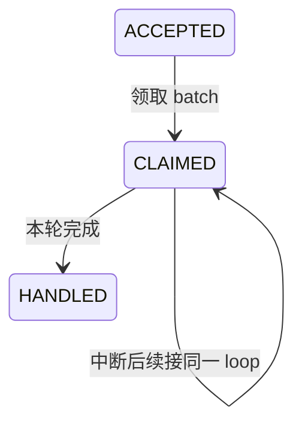
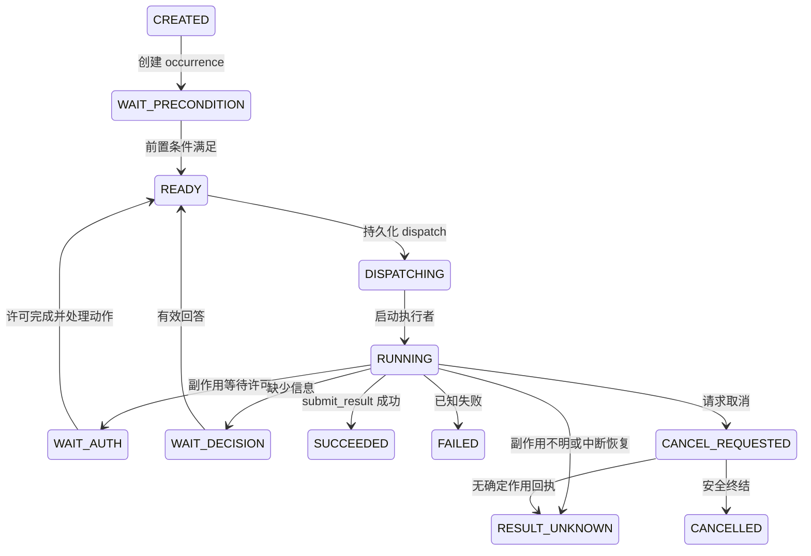

# 状态机与实际流转

运行时 [catalog](../src/state_machine/catalog.json) 被 Store 加载，但当前只有 `Authorization.decide` 使用 `next()` 查迁移表。其他模块直接提交状态，`shape()` 校验的是记录形状而不是全局迁移合法性。因此 catalog 的全部边不能解释为代码已实现或已测试的路径。

## 主会话与输入

Host 构造时恢复会话及中断的整理任务。输入从 `ACCEPTED` 到 `CLAIMED`，领取与 prompt 快照一同提交，完成后为 `HANDLED`。Session 在正常处理时从 `IDLE` 进入 `RUNNING` 再回到 `IDLE`；容量或恢复故障进入 `CAPACITY_BLOCKED` / `RECOVERY_BLOCKED`。`resume()` 将状态置回 IDLE 后重试，不能修复缺失的对象字节。

```mermaid
stateDiagram-v2
  ACCEPTED --> CLAIMED: 领取 batch
  CLAIMED --> HANDLED: 本轮完成
  CLAIMED --> CLAIMED: 中断后续接同一 loop
```

## 任务执行

```mermaid
stateDiagram-v2
  CREATED --> WAIT_PRECONDITION: 创建 occurrence
  WAIT_PRECONDITION --> READY: 前置条件满足
  READY --> DISPATCHING: 持久化 dispatch
  DISPATCHING --> RUNNING: 启动执行者
  RUNNING --> WAIT_AUTH: 副作用等待许可
  WAIT_AUTH --> READY: 许可完成并处理动作
  RUNNING --> WAIT_DECISION: 缺少信息
  WAIT_DECISION --> READY: 有效回答
  RUNNING --> SUCCEEDED: submit_result 成功
  RUNNING --> FAILED: 已知失败
  RUNNING --> RESULT_UNKNOWN: 副作用不明或中断恢复
  RUNNING --> CANCEL_REQUESTED: 请求取消
  CANCEL_REQUESTED --> CANCELLED: 安全终结
  CANCEL_REQUESTED --> RESULT_UNKNOWN: 无确定作用回执
```

图为主路径；详细分支以 Scheduler 的 `tick/execute/finish/cancel/recover` 为准。未知效果不能因取消直接变为无副作用；`RESULT_UNKNOWN` 不属于 terminal 集合。

TaskPlan 初始化为 `INITIALIZING`，成功转 `ACTIVE`，失败为 `INIT_FAILED`。触发支持 IMMEDIATE / AT / INTERVAL；每个 task 同时一个非终结 occurrence，不同 task 可并发。INTERVAL 的 QUEUE 保存 pending occurrences；重启遇到已错过 AT 则暂停并记录 missed，周期严重迟到跳过窗口并记录 REPORT_ONLY，不能解释成补跑保证。

## 操作与授权

Operation：PREPARED → WAIT_AUTH 或 AUTHORIZED；批准后为 AUTHORIZED，拒绝/撤销为 CANCELLED；最终 gate 成功才写 DISPATCHED；回执为 SUCCEEDED / FAILED / RESULT_UNKNOWN。恢复时没有启动的操作重绑定 owner epoch，DISPATCHED 但无回执变为 RESULT_UNKNOWN。

AuthorizationRequest：PENDING → APPROVED / REJECTED；撤销与其他合法边由 catalog 检查。dispatch 再核对许可状态、有效期、action 一致性后消费为 CONSUMED。版本冲突或展示摘要不同不会批准。

## 其他持久状态

| 对象 | 代码中的主要生命周期 |
| --- | --- |
| ModelCall | PREPARED → IN_FLIGHT → RESPONSE_SAVED / FAILED / INTERRUPTED |
| DecisionRequest | OPEN → ANSWERED；任务结束时未决请求变 OBSOLETE |
| Feedback | QUEUED → DELIVERED（关联 Input）→ HANDLED |
| Notification | Host 创建 QUEUED；旧控制器 presented 可转 SENT；新通知 Delivery 的 received/presented/read 由显式 ACK 单调保存 |
| CompactionJob | SUMMARIZING → COMMITTED / STALE / FAILED；最多两次摘要尝试 |
| MemoryCommitment | OPEN → COMPLETED / CANCELLED；宿主保留来源与处理记录 |
| Execution.retention_state | HOT → RETIRED；已终结且无待处理工作才可归档 |

48 小时留存阈值不是删除期限。归档保留证据，当前无历史 GC。状态字段的完整枚举见 [数据索引](data/README.md)，它们可能包含尚未走通的设计预留值。

## 设置应用

`SettingsApplication` 由 Settings 协调器推进：QUEUED → SUMMARIZING → COMMITTING（有 World 写入时）→ REBUILDING → APPLIED。确定未提交时为 FAILED；结果未知或提交后重建未完成为 BLOCKED。来源与候选按不可变引用保存，最后一帧同时提交记忆、说明、context 指针和 APPLIED。详细并发、重启和配置变化规则见[设置生效规范](settings-activation.md)。

## 提取恢复

`ExtractionRecovery` 是显式请求的持久记录，`CLAIMED` 表示一次授权已经消费；只有该来源当前领取代次可以推进结果。原 attempt 日志不可变，新 attempt 关联父 attempt 与请求。Store 的独占 owner 锁、同步 journal 提交及 revision CAS 提供本地串行化，不使用超时租约重新获得发送权。

| 磁盘证据与当前条件 | 预检/恢复行为 |
| --- | --- |
| 来源、owner、policy、配置、revision 不匹配，ModelCall/Context/请求证据不一致或 legacy 无精确证据 | BLOCKED，无发送 |
| 旧进程中 attempt 仍活跃 | BLOCKED，不把点击当作隔离 |
| 自动 attempt 已明确失败且尚未创建 ModelCall | READY，显式授权最多一次新调用 |
| 精确关联的 ModelCall 仅 PREPARED，尚未 IN_FLIGHT | 可确认本地未发；尚未消费恢复授权时才可 READY |
| started 无终态/无精确调用关联，或 IN_FLIGHT/INTERRUPTED 无完整终态 | BLOCKED，重启不发送 |
| 已保存 error/aborted 响应 | BLOCKED，不把错误响应当供应商未执行证明 |
| 已保存完整终态但输出不满足提取协议，且本地旧执行已结束 | READY，可明确授权新调用，显示再次计费边界 |
| 已保存合法完整响应 | RECONCILE，确定性复用，零新调用 |
| 已有提取成功或原 owner 已提交 | 复用结果/回执，不重复提取或提交 |
| 恢复授权已消费而尚无完整结果 | 同请求只对账或 BLOCKED，不退还授权后再发送 |

预检不修改持久 Store；只在当前进程内签发有效期 5 分钟的凭证。新消费先核验服务端签发记录、完整绑定和有效期；过期、客户端延长、服务重启后的未消费凭证拒绝，允许重新预检。已消费 request_id 的持久回执优先对账，期限不恢复发送权。

RECONCILE 是用户显式发起的写操作，记录请求和对账结果，但不产生模型调用。提取成功与原批次提交是不同检查点：后者仍需完整来源、候选、任务事实和版本校验，设置路径还须核查 World 回执。

## API 命令状态与能力

[ApiCommand](data/ApiCommand.md) 是传输命令受理状态，不替代 Execution、Operation 或 SettingsApplication。短命令保持 ACCEPTED；后续业务初始化或执行由资源本身反映。包括 NO_CHANGES 在内的成功受理均可重放回执，不能要求所有短命令最终出现 COMPLETED。

长命令实际路径为 QUEUED → RUNNING → COMPLETED；派发异常或重启发现 RUNNING 时转 UNKNOWN，保留 error_code 及资源。FAILED 虽在 schema 枚举中，目前 ApplicationService 不以它表示派发异常。首次接收前格式/冲突等拒绝可以没有 ApiCommand，HTTP 错误不能凭空算一次成功受理。

Core capabilities 中 devices、attachments 为 not_supported；reliable_sync 在显式初始化前为 not_configured，初始化后 supported；world 未配置为 not_configured。能力存在与具体资源/权限可执行性分别判断，不以页面已画出或数据为空推断 supported。通知送达通过显式 Delivery ACK；GET timeline 或 received 不能自动完成依赖展示证据的承诺。
