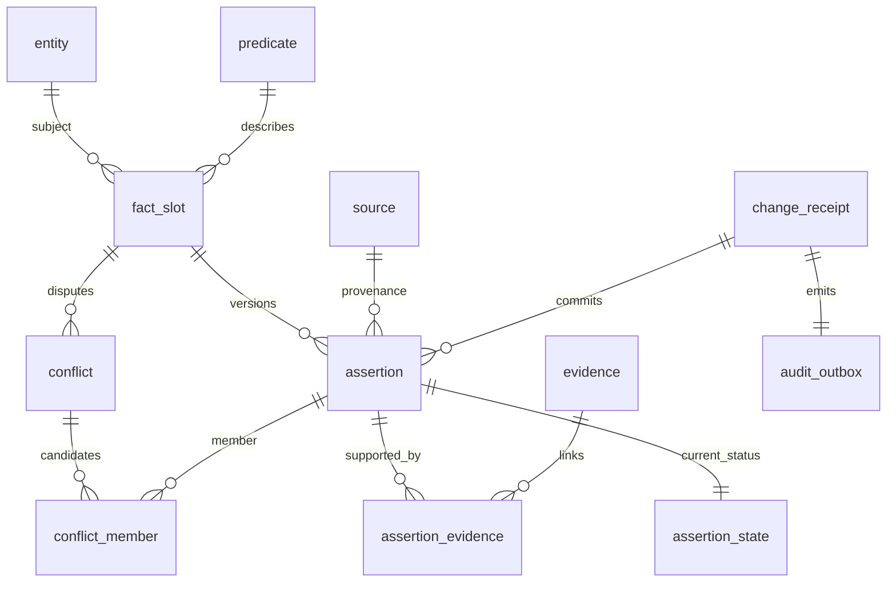

# World Model PostgreSQL 设计总览

仅 World Model 的事实、来源、关系、历史与变更提交回执在 PostgreSQL。主会话、Scheduler、Consciousness、授权范围及 Operation Log 不放入数据库。audit_outbox 仅用于 World Model 提交向原始日志交接，不是第二份全局 Operation Log。

DDL：[001_world_model.sql](001_world_model.sql)。预定义字段/谓词：[002_predicates.sql](002_predicates.sql)。查询模板：[queries.sql](queries.sql)。事务与字段映射：[TRANSACTIONS.md](TRANSACTIONS.md)。

实体 + 预定义谓词 + 带来源的主张，代替把所有事实塞进一个无约束 JSONB。人物、组织、项目、目标、设备、服务与资源共用实体身份；身高单位和联系方式形状等由谓词预先定义。关系用外键 `object_entity_id`，标量/结构值用 JSONB，二者互斥。JSONB 不用于保存原 context 的原字节；[PostgreSQL JSON 类型文档](https://www.postgresql.org/docs/18/datatype-json.html)说明其规范化存储特征。

## 表与所有权

| 表 | 主键/关键约束 | 用途与写入方 |
| --- | --- | --- |
| schema_version | version | 迁移版本，人工部署 |
| entity | entity_id；external_key 唯一 | 已知对象的身份；World Model 后端 |
| source | source_id；source_key 唯一 | Master/观测/任务报告/推断来源身份，不是权限描述 |
| predicate | predicate_key | 预定义字段、类型、单位、JSON Schema 与对象种类；人工维护 |
| fact_slot | slot_id；subject+predicate+scope 唯一 | 乐观 revision 与冲突粒度；单值 scope 为空，多值必须具体 |
| assertion | assertion_id；slot+revision 唯一 | 不可改原始事实主张、来源时间、有效时间、替代关系 |
| assertion_state | assertion_id；同 slot 至多一个 ACTIVE | 当前投影，允许多个 SUPPORTING/CONTESTED，不改原主张 |
| evidence | evidence_id；event+hash 唯一 | 指向原始日志事件与 immutable object |
| assertion_evidence | assertion+evidence | 至少一条依据，延迟约束触发器提交时校验 |
| conflict / conflict_member | 同 slot 至多一个 OPEN conflict | 分歧及候选，跨 slot 关联由复合 FK 拒绝 |
| change_receipt | change_id；request_id 唯一 | 幂等提交结果及请求摘要，不存授权范围 |
| audit_outbox | event_id；change_id 唯一 | 与事实同事务产生的待导出审计事件 |

## 约束与索引

数据库保证身份/FK、单值 ACTIVE 唯一、值/关系互斥、类型、时间范围、不可变主张和证据存在。程序负责完整 JSON Schema、来源与 epistemic 一致性、predicate 不涉及权限、跨存储证据对象存在及全部状态转换。`value_schema` 不由 PostgreSQL 内置解析；应用校验缺失必须拒绝，不能只靠 jsonb_typeof。

跨行一致性使用 FK/唯一索引或触发器，不能把跨行查询塞进 CHECK；依据 [PostgreSQL 约束文档](https://www.postgresql.org/docs/18/ddl-constraints.html)。事务选择和并发处理见 TRANSACTIONS。

定义已经被事实使用的 predicate 时，不原地改变其类型、单位或 cardinality；需要新 key 或显式迁移。实体 kind 和已有 source.kind 同样禁止无迁移改变。Demo 只运行空库 baseline，不提供破坏性降级脚本。程序用户使用独立角色，模型和 worker 不持有 PG 凭据；真实角色/口令配置留给部署，不写本仓库。

## 读取、历史与时效

当前查询返回 ACTIVE、SUPPORTING 与 CONTESTED 主张及来源、有效时间、freshness；时间新不自动消除冲突。valid_from/to 表示事实成立范围，received_at 是接收时间。fresh_until=null 返回 UNKNOWN，不默认为永远 CURRENT。不可变历史通过 assertion/change_receipt/evidence 查询；RETRACTED/SUPERSEDED 不从历史删除。

查询按 slot_id/assertion_id 稳定排序；游标包含筛选摘要与读取快照标识，失效返回明确错误。分页跨事务的快照一致性通过应用读到的 revision 标记表达，不宣称任意翻页获得 PostgreSQL 长期快照。
