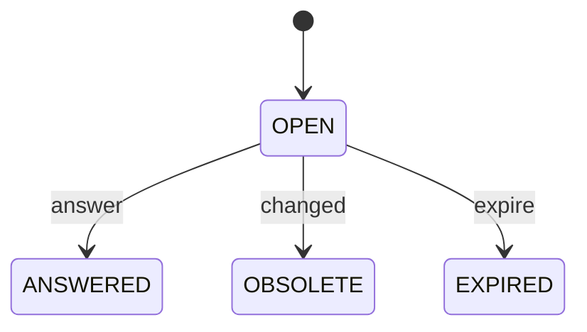

# Decision 状态机

管理方：`scheduler`。初态：`OPEN`。终态：ANSWERED, OBSOLETE, EXPIRED。

状态值与 JSON 契约一致；未列出的转换拒绝。重复事件按 request/event ID 返回旧回执，不能重复执行动作。guards 的具体含义见 [GUARDS.md](GUARDS.md)。

| 转换 ID | 前态 + 事件 → 后态 | 前置条件 | 同步持久化结果 |
| --- | --- | --- | --- |
| Decision-01 | OPEN + answer → ANSWERED | `request_revision_matches` | 保存普通工作决定 |
| Decision-02 | OPEN + changed → OBSOLETE | `scope_changed` | 不沿用旧回复 |
| Decision-03 | OPEN + expire → EXPIRED | `explicit_deadline` | 没有回复不表示同意 |
