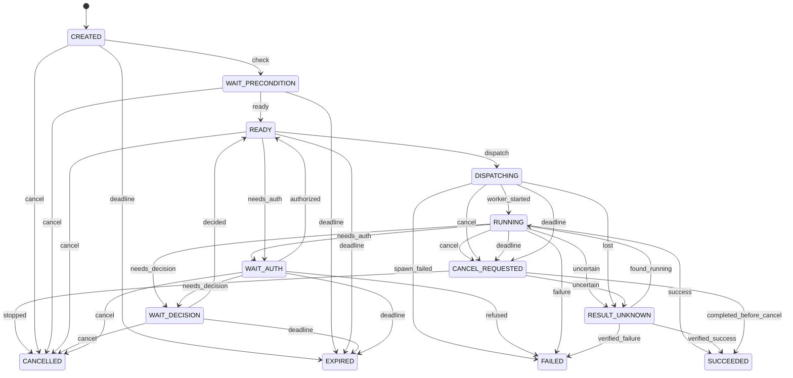

# Execution 状态机

管理方：`scheduler`。初态：`CREATED`。终态：SUCCEEDED, FAILED, CANCELLED, EXPIRED。

状态值与 JSON 契约一致；未列出的转换拒绝。重复事件按 request/event ID 返回旧回执，不能重复执行动作。guards 的具体含义见 [GUARDS.md](GUARDS.md)。

| 转换 ID | 前态 + 事件 → 后态 | 前置条件 | 同步持久化结果 |
| --- | --- | --- | --- |
| Execution-01 | CREATED + check → WAIT_PRECONDITION | `trigger_due` | 保存前提检查 |
| Execution-02 | WAIT_PRECONDITION + ready → READY | `preconditions_met` | 清除可恢复等待 |
| Execution-03 | READY + dispatch → DISPATCHING | `enabled_revision_and_no_overlap` | 保存 Dispatch 与 attempt_id |
| Execution-04 | DISPATCHING + worker_started → RUNNING | `matching_epoch_attempt` | 关联 worker |
| Execution-05 | DISPATCHING + spawn_failed → FAILED | `definite_not_started` | 保存失败结果 |
| Execution-06 | RUNNING + needs_decision → WAIT_DECISION | `materials_saved` | 持有 DecisionRequest |
| Execution-07 | WAIT_DECISION + decided → READY | `valid_decision_and_conditions` | 保存普通决定 |
| Execution-08 | RUNNING + needs_auth → WAIT_AUTH | `operation_prepared` | 持有 AuthorizationRequest |
| Execution-09 | WAIT_AUTH + authorized → READY | `grant_current` | 待执行操作仍须最终 gate |
| Execution-10 | WAIT_AUTH + refused → FAILED | `task_cannot_continue` | 保存拒绝结果 |
| Execution-11 | RUNNING + success → SUCCEEDED | `result_and_evidence_saved` | 结果已可查再创建反馈 |
| Execution-12 | RUNNING + failure → FAILED | `known_failed` | 保存已知影响 |
| Execution-13 | RUNNING + uncertain → RESULT_UNKNOWN | `missing_effect_result` | 停止相关操作并反馈 |
| Execution-14 | DISPATCHING + lost → RESULT_UNKNOWN | `may_have_started` | 先查 worker/receipt |
| Execution-15 | RESULT_UNKNOWN + verified_success → SUCCEEDED | `new_evidence` | 记录核验依据 |
| Execution-16 | RESULT_UNKNOWN + verified_failure → FAILED | `new_evidence` | 不自动重试 |
| Execution-17 | RESULT_UNKNOWN + found_running → RUNNING | `identity_verified` | 接回原 worker，不新起重复者 |
| Execution-18 | CANCEL_REQUESTED + stopped → CANCELLED | `stop_and_effects_known` | 保存停止证据 |
| Execution-19 | CANCEL_REQUESTED + uncertain → RESULT_UNKNOWN | `effects_unknown` | 保留取消意图 |
| Execution-20 | CANCEL_REQUESTED + completed_before_cancel → SUCCEEDED | `completion_proven` | 报告取消未阻止完成 |
| Execution-21 | CREATED + cancel → CANCELLED | `no_inflight_effect` | 未开始的相关操作取消 |
| Execution-22 | CREATED + deadline → EXPIRED | `deadline_elapsed_and_no_inflight` | 到期结束；无期限不自行过期 |
| Execution-23 | WAIT_PRECONDITION + cancel → CANCELLED | `no_inflight_effect` | 未开始的相关操作取消 |
| Execution-24 | WAIT_PRECONDITION + deadline → EXPIRED | `deadline_elapsed_and_no_inflight` | 到期结束；无期限不自行过期 |
| Execution-25 | READY + cancel → CANCELLED | `no_inflight_effect` | 未开始的相关操作取消 |
| Execution-26 | READY + deadline → EXPIRED | `deadline_elapsed_and_no_inflight` | 到期结束；无期限不自行过期 |
| Execution-27 | WAIT_DECISION + cancel → CANCELLED | `no_inflight_effect` | 未开始的相关操作取消 |
| Execution-28 | WAIT_DECISION + deadline → EXPIRED | `deadline_elapsed_and_no_inflight` | 到期结束；无期限不自行过期 |
| Execution-29 | WAIT_AUTH + cancel → CANCELLED | `no_inflight_effect` | 未开始的相关操作取消 |
| Execution-30 | WAIT_AUTH + deadline → EXPIRED | `deadline_elapsed_and_no_inflight` | 到期结束；无期限不自行过期 |
| Execution-31 | RUNNING + cancel → CANCEL_REQUESTED | `request_valid` | 只记录请求；停止须回执 |
| Execution-32 | DISPATCHING + cancel → CANCEL_REQUESTED | `request_valid` | 只记录请求；停止须回执 |
| Execution-33 | READY + needs_auth → WAIT_AUTH | `operation_prepared` | 程序启动先创建受控 program.run 请求，不先启动程序 |
| Execution-34 | WAIT_AUTH + needs_decision → WAIT_DECISION | `materials_saved` | 授权拒绝后请求普通方案选择，不能把选择变批准 |
| Execution-35 | RUNNING + deadline → CANCEL_REQUESTED | `deadline_elapsed` | 保存到期原因，等待实际停止 |
| Execution-36 | DISPATCHING + deadline → CANCEL_REQUESTED | `deadline_elapsed` | 先核实分派，不把超时当未发生 |
