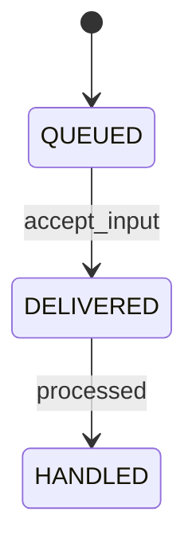

# Feedback 状态机

管理方：`scheduler/host`。初态：`QUEUED`。终态：HANDLED。

状态值与 JSON 契约一致；未列出的转换拒绝。重复事件按 request/event ID 返回旧回执，不能重复执行动作。guards 的具体含义见 [GUARDS.md](GUARDS.md)。

| 转换 ID | 前态 + 事件 → 后态 | 前置条件 | 同步持久化结果 |
| --- | --- | --- | --- |
| Feedback-01 | QUEUED + accept_input → DELIVERED | `details_durable` | 与 Input.ACCEPTED 同事务；按 feedback_id 去重 |
| Feedback-02 | DELIVERED + processed → HANDLED | `loop_handled` | 记录主会话已处理 |
