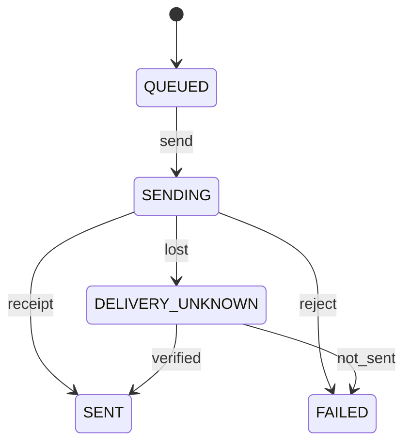

# Notification 状态机

管理方：`interaction`。初态：`QUEUED`。终态：SENT, FAILED。

状态值与 JSON 契约一致；未列出的转换拒绝。重复事件按 request/event ID 返回旧回执，不能重复执行动作。guards 的具体含义见 [GUARDS.md](GUARDS.md)。

| 转换 ID | 前态 + 事件 → 后态 | 前置条件 | 同步持久化结果 |
| --- | --- | --- | --- |
| Notification-01 | QUEUED + send → SENDING | `channel_ready` | 持久化发送意图 |
| Notification-02 | SENDING + receipt → SENT | `delivery_receipt` | 不等于已读 |
| Notification-03 | SENDING + reject → FAILED | `definite_not_sent` | 记录失败 |
| Notification-04 | SENDING + lost → DELIVERY_UNKNOWN | `may_have_sent` | 先查询渠道，不盲目重发 |
| Notification-05 | DELIVERY_UNKNOWN + verified → SENT | `channel_evidence` | 补投递回执 |
| Notification-06 | DELIVERY_UNKNOWN + not_sent → FAILED | `channel_evidence` | 新发送由主会话决定 |
