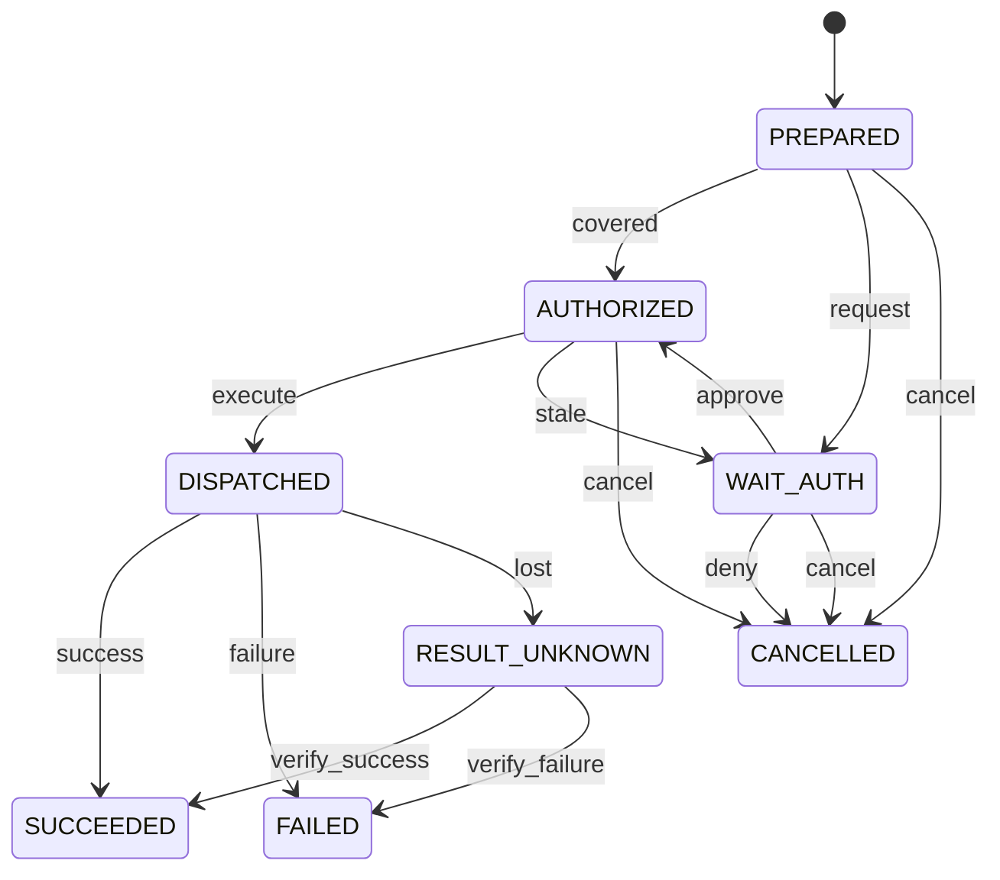

# Operation 状态机

管理方：`gateway`。初态：`PREPARED`。终态：SUCCEEDED, FAILED, CANCELLED。

状态值与 JSON 契约一致；未列出的转换拒绝。重复事件按 request/event ID 返回旧回执，不能重复执行动作。guards 的具体含义见 [GUARDS.md](GUARDS.md)。

| 转换 ID | 前态 + 事件 → 后态 | 前置条件 | 同步持久化结果 |
| --- | --- | --- | --- |
| Operation-01 | PREPARED + covered → AUTHORIZED | `rule_matches` | 保存规则版本与范围 |
| Operation-02 | PREPARED + request → WAIT_AUTH | `valid_not_covered` | 生成授权请求 |
| Operation-03 | WAIT_AUTH + approve → AUTHORIZED | `master_ui_valid` | 绑定 grant |
| Operation-04 | WAIT_AUTH + deny → CANCELLED | `master_reject_or_expire` | 无执行 |
| Operation-05 | AUTHORIZED + execute → DISPATCHED | `final_gate` | 一次提交 consume grant + dispatch intent |
| Operation-06 | AUTHORIZED + stale → WAIT_AUTH | `grant_or_target_changed` | 原 grant 不再适用 |
| Operation-07 | DISPATCHED + success → SUCCEEDED | `durable_receipt` | 结果与证据留存 |
| Operation-08 | DISPATCHED + failure → FAILED | `known_effects` | 保存实际影响 |
| Operation-09 | DISPATCHED + lost → RESULT_UNKNOWN | `outcome_unknown` | 禁止重做 |
| Operation-10 | RESULT_UNKNOWN + verify_success → SUCCEEDED | `evidence` | 只补证据 |
| Operation-11 | RESULT_UNKNOWN + verify_failure → FAILED | `evidence` | 新重试须新操作且符合安全规则 |
| Operation-12 | PREPARED + cancel → CANCELLED | `no_inflight_effect` | 未分派；撤下批准请求或使批准不可消费 |
| Operation-13 | WAIT_AUTH + cancel → CANCELLED | `no_inflight_effect` | 未分派；撤下批准请求或使批准不可消费 |
| Operation-14 | AUTHORIZED + cancel → CANCELLED | `no_inflight_effect` | 未分派；撤下批准请求或使批准不可消费 |
