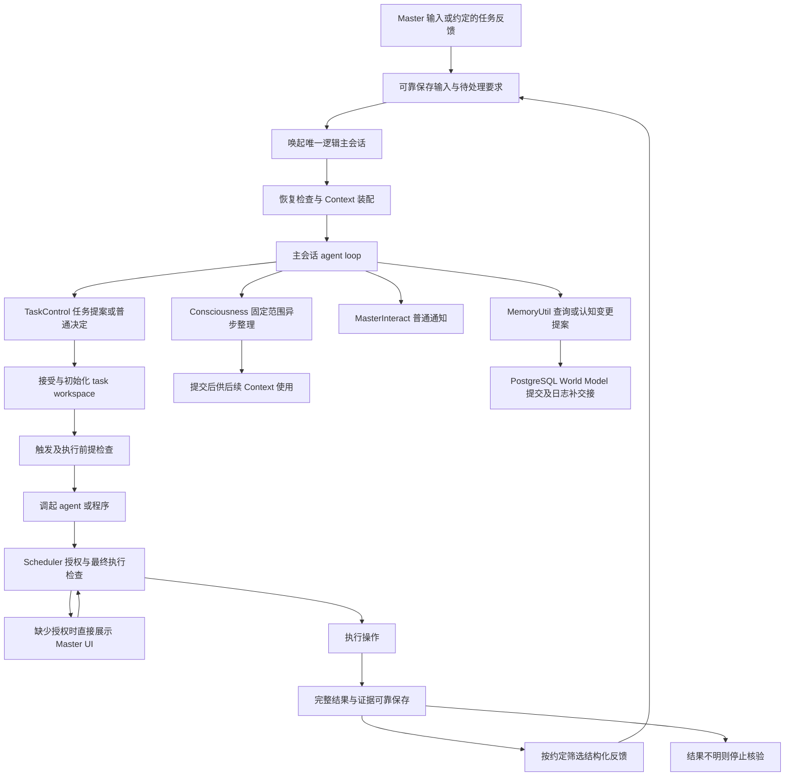

# 状态机总览

依据 BrainStorm 2.4–2.5、3.2–3.5、5.1–5.8。完整值域与转换唯一来源为 [catalog.json](catalog.json)，模块文档按同一数据生成。guards 在 [GUARDS.md](GUARDS.md) 定义；状态字段来自 [JSON 契约](../json/contracts.schema.json)。

整体系统是多台状态机的组合，不设一个同时描述任务、主会话、授权和存储的全局状态枚举。应用是否启动、主会话是否运行、任务是否执行彼此独立。

## 模块划分

| 模块 | 状态机文档 | 核心边界 |
| --- | --- | --- |
| 唯一主会话宿主 | [Host](Host.md)、[Input](Input.md)、[Call](Call.md) | 新输入可靠保留；单个 loop；工具结果属于当前 loop |
| Consciousness | [Compaction](Compaction.md) | 固定范围、CAS 提交、先保存后移除原文 |
| 计划与执行 | [Plan](Plan.md)、[Execution](Execution.md)、[Retention](Retention.md) | 计划与实例分开；终态不重新激活；48h 仅候选留存参数 |
| 操作与批准 | [Operation](Operation.md)、[Authorization](Authorization.md) | 批准来自 UI；不确定不重做；批准与 dispatch 意图一起消费 |
| 工作决定与反馈 | [Decision](Decision.md)、[Feedback](Feedback.md) | 普通工作决定不是授权；先详情后结论 |
| 普通通知 | [Notification](Notification.md) | 已发送不等于已读；发送结果不明不盲重发 |
| World Model | [WorldCommand](WorldCommand.md) | PG receipt 确认提交；JSON 日志可补交接 |
| 程序登记 | [Program](Program.md) | 人工维护，版本固定与分派前检查 |

## 整体不变量

1. 只有持久化成功才向调用者确认 ACCEPTED。新输入内容与待处理要求属于同一 journal 事务。
2. 同一逻辑主会话一个处理者；epoch 变化不能授予旧 worker 新操作能力。
3. 工具/操作意图先保存，再外部执行；回执缺失意味着结果不明，不意味着失败且可重试。
4. 主会话无授权写入口，普通 TaskControl 决定不能修改 AuthorizationRequest。
5. Context 复载保留原字节；读取历史只重建状态，不调用历史工具。
6. Execution 终结与 Retention 退出分离；待决定、待授权、RESULT_UNKNOWN 不满足回收条件。
7. 所有跨模块转换要么在单一 JSON journal 事务提交，要么有明确补交接协议，见 [持久化](../demo_design/PERSISTENCE.md)。

## 原子边界与恢复

| 边界 | 一个可靠提交包含什么 | 提交前失败 / 提交后失败 |
| --- | --- | --- |
| 接收输入 | Input + 完整原文引用 + 日志 + 幂等回执 | 不确认 / 返回旧回执并继续唤起 |
| 接受提案 | TaskPlan INITIALIZING + request receipt + 日志 | 可重试同 request_id / 继续初始化同 task_id |
| 分派执行 | Execution DISPATCHING + Dispatch attempt + 日志 | 不起 worker / 核对原 attempt，不重复 spawn |
| 批准操作 | UI 决定 + AuthorizationRequest APPROVED | 不放行 / 批准可供最终 gate 检查 |
| 实际执行 | Operation DISPATCHED + 消费批准 + intent 日志 | 不执行 / 回执不明则停止核验 |
| 交付结果 | TaskResult + 终结 Execution + Feedback QUEUED + 日志 | 不反馈结论 / 重投同 feedback_id |
| 反馈入主会话 | Input ACCEPTED + Feedback DELIVERED | 反馈继续待投 / 输入去重 |
| 摘要承接 | Consciousness 新 revision + covered_event_ids + job COMMITTED | 原文仍在 / 新摘要可用，后来输入保留 |
| World Model | PG 内事实/冲突/receipt/outbox 同事务 | 同 change_id 查 receipt / outbox 补入 journal |

取消请求与完成同时到达时，以已有回执与实际影响为准，不能因取消意图掩盖已完成作用。WAIT_AUTH/WAIT_DECISION 是执行管理状态，不要求 worker 一直在线。
