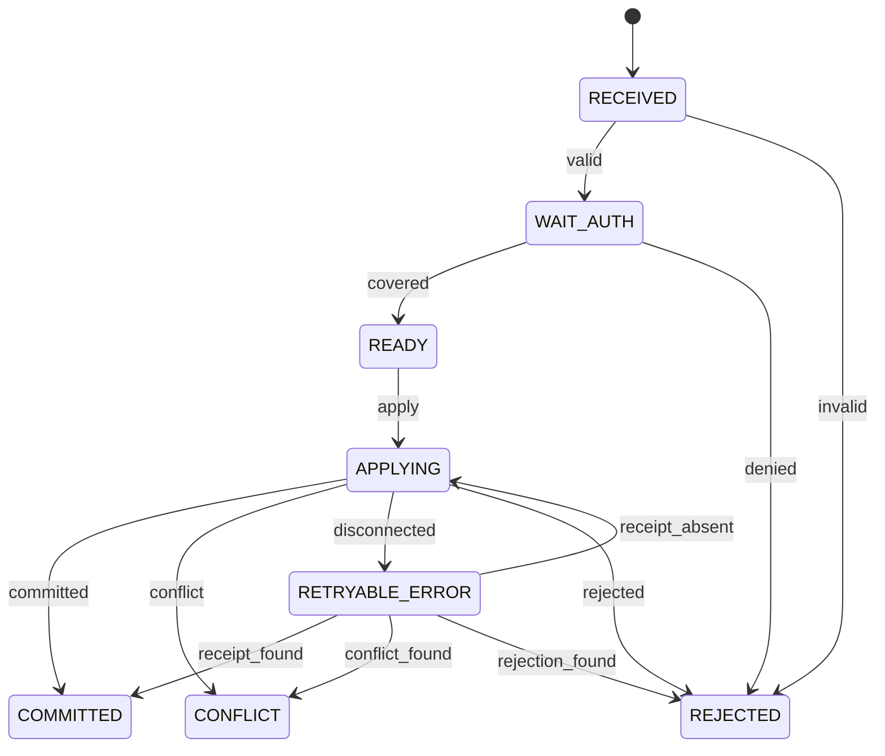

# WorldCommand 状态机

管理方：`worldmodel`。初态：`RECEIVED`。终态：COMMITTED, CONFLICT, REJECTED。

状态值与 JSON 契约一致；未列出的转换拒绝。重复事件按 request/event ID 返回旧回执，不能重复执行动作。guards 的具体含义见 [GUARDS.md](GUARDS.md)。

| 转换 ID | 前态 + 事件 → 后态 | 前置条件 | 同步持久化结果 |
| --- | --- | --- | --- |
| WorldCommand-01 | RECEIVED + valid → WAIT_AUTH | `registered_predicate_and_provenance` | 请求统一授权 |
| WorldCommand-02 | RECEIVED + invalid → REJECTED | `invalid_payload` | 记录原因 |
| WorldCommand-03 | WAIT_AUTH + covered → READY | `valid_grant_or_rule` | 保存授权引用 |
| WorldCommand-04 | WAIT_AUTH + denied → REJECTED | `denied` | 不写 PG |
| WorldCommand-05 | READY + apply → APPLYING | `final_gate` | 保留稳定 change_id |
| WorldCommand-06 | APPLYING + committed → COMMITTED | `pg_receipt_exists` | 从 PG receipt 补日志 |
| WorldCommand-07 | APPLYING + conflict → CONFLICT | `revision_mismatch` | 保存冲突，重新提案使用新 change_id |
| WorldCommand-08 | APPLYING + disconnected → RETRYABLE_ERROR | `unknown_pg_commit` | 先查同 change_id receipt |
| WorldCommand-09 | RETRYABLE_ERROR + receipt_found → COMMITTED | `hash_matches` | 不重复写事实 |
| WorldCommand-10 | RETRYABLE_ERROR + receipt_absent → APPLYING | `pg_reachable_and_no_receipt` | 仅补做同一已分派 PG 事务，不重新消费批准 |
| WorldCommand-11 | RETRYABLE_ERROR + conflict_found → CONFLICT | `pg_receipt_exists` | 复用 PG 的 CONFLICT receipt |
| WorldCommand-12 | RETRYABLE_ERROR + rejection_found → REJECTED | `pg_receipt_exists` | 复用 PG 的 REJECTED receipt |
| WorldCommand-13 | APPLYING + rejected → REJECTED | `pg_receipt_exists` | 事务内业务校验拒绝 |
